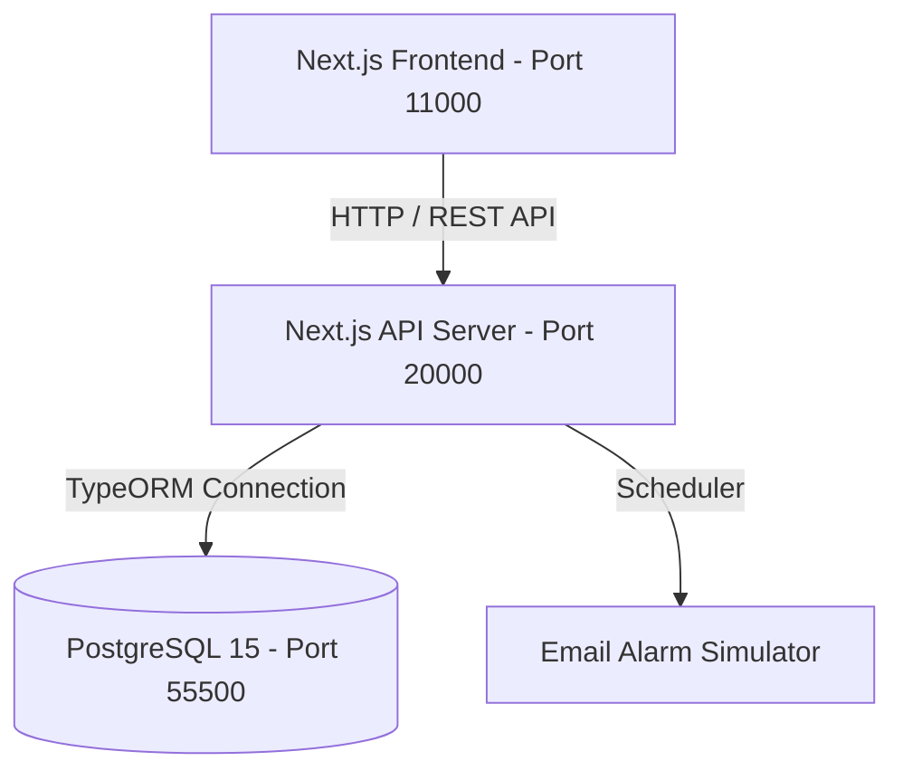

# 🇰🇷 한능검 CBT & 한국사 학습 플랫폼 (Hanneunggeom CBT Study)

> **한국사능력검정시험(심화)의 실제 기출문제 분석부터 시대별 벼락치기 퀴즈, 오답노트, 핵심 요약 자료, 시험 일정 알림 신청 및 1:1 건의사항 게시판까지 지원하는 올인원 웹 애플리케이션 플랫폼입니다.**

---

## 📌 주요 특징 및 제공 기능

### 📝 1. CBT 기출문제 풀이 (실전 모의고사)
- 실제 **한능검 심화 기출문제**를 바탕으로 모의고사를 풀고 실시간으로 채점받을 수 있는 인터페이스입니다.
- 개별 문항별 배점, 정답률, 상세 해설 및 오답 해설이 완벽하게 지원됩니다.
- > [!IMPORTANT]
  > 현재 CBT 기출문제 탭은 개발 중인 상태로, 일반 사용자에게는 노출되지 않으며 **`admin` 계정으로 로그인한 상태에서만 접근 및 조회가 가능**합니다.

### ⚡ 2. 시대별 벼락치기 퀴즈
- 구석기/신석기 선사시대부터 고조선, 삼국시대, 고려, 조선, 근현대사까지 **10대 시대별 테마 퀴즈**를 제공합니다.
- AI 생성 퀴즈와 실제 기출문제를 명확히 구분하여 학습의 신뢰성을 높였습니다.

### 📚 3. 한국사 요약 자료실
- 시대별/분야별(정치, 경제, 사회, 문화) 핵심 이론을 한눈에 볼 수 있는 마크다운 기반 정적 요약 노트를 제공합니다.

### 🔔 4. 시험 일정 관리 및 이메일 알림
- 한능검 시험 일정을 실시간으로 조회하고 원서 접수 시작일, 접수 마감 7일 전, 시험 D-day 당일에 맞춰 **이메일/알림 메일 발송 신청**을 지원합니다.
- 스케줄러 라이브러리를 통해 백그라운드에서 주기적으로 발송 대상자를 추출하여 발송 시뮬레이션 로그를 기록합니다.

### 💬 5. 1:1 문의사항 게시판
- 로그인된 사용자만 자유롭게 건의사항을 남길 수 있는 커뮤니티 공간입니다.
- **댓글 및 대댓글(답글)** 기능을 지원하며, 답글 시 본문 상단에 `@닉네임 ` 태그가 연동됩니다.
- 대댓글 등록 시 언급된 원작성자 혹은 게시글 작성자를 매칭하여 **서버 콘솔에 이메일 발송 로그를 자동으로 남기는 시뮬레이션 알림** 기능이 탑재되어 있습니다.
- > [!WARNING]
  > **개인정보 보호(이메일 마스킹)**: 모든 작성자의 이메일은 `@` 앞부분 문자열의 뒤쪽 절반이 `*` 처리되고 도메인은 전면 삭제(예: `testuser@example.com` -> `test****`)되어 닉네임으로 활용됩니다. 개발자 도구의 API Network Response 자체에서 마스킹된 데이터만 반환되므로 유출 위험이 없습니다. (관리자는 '관리자'로 닉네임이 고정됩니다.)

---

## 🛠️ 기술 아키텍처 및 스택



- **Frontend**: Next.js 14 (App Router), Tailwind CSS, React
- **Backend**: Next.js 14 API Routes, TypeScript
- **ORM / DB**: TypeORM 0.3.x, PostgreSQL 15 (Alpine)
- **Containerization**: Docker Compose 멀티 컨테이너 구성 (FE / BE / DB)

---

## 🚀 빌드 및 실행 가이드

모든 인프라와 배포 스크립트는 `Makefile`과 `docker-compose`를 통해 통합 관리됩니다.

### 1) 서비스 일괄 가동
컨테이너 빌드, 기존 볼륨 제거 및 초기 구동을 원스톱으로 처리합니다.
```bash
make start
```
> [!TIP]
> 서비스가 정상 구동되면 아래 포트로 각각 접속이 가능합니다.
> - **프론트엔드**: `http://localhost:11000`
> - **백엔드 API**: `http://localhost:20000`
> - **데이터베이스**: `localhost:55500` (`user` / `password` / `hanneunggeom`)

### 2) 서비스 종료 및 정리
컨테이너를 정지하고, 미사용 리소스 및 볼륨을 완전히 비웁니다.
```bash
make down    # 컨테이너 정지 및 리소스 삭제
make clean   # 볼륨 및 미사용 이미지까지 전면 제거
```

### 3) 덤프 데이터 초기화 및 Seeding 복원 (`make init-db`)
새로 배포했거나 로컬 개발 중 테스트 데이터를 지우고 **완벽하게 동일한 초기 스키마 및 마스터 데이터 상태로 롤백**하고 싶을 때 사용합니다.
```bash
make init-db
```
- **안전장치(Safe Guard)**: 실행 시 현재 DB와 `init.sql`을 실시간으로 비교 분석합니다. 만약 데이터가 추가되거나 변경되었다면 아래와 같은 안내창이 나타나며 승인을 요구합니다.
  ```text
  🔍 현재 데이터베이스 상태를 분석 중입니다...
  ⚠️ 경고: 현재 데이터베이스 상태가 init.sql(초기 상태)과 다릅니다! (새로운 데이터 추가 또는 변경 감지)
  정말로 데이터베이스를 초기 상태로 리셋하시겠습니까?
  진행하시겠습니까? (y/n):
  ```
- `y` 입력 시 완벽한 덤프 초기화가 실행되며, `n` 입력 시 기존 DB 데이터가 그대로 유지됩니다.

---

## 🗄️ 데이터베이스 스키마 구성

DB 테이블 및 관계(Relations)는 TypeORM 엔티티 구조를 기반으로 설계되었습니다. N+1 쿼리 방지 조인 최적화가 적용되어 있습니다.

| 테이블명 | 역할 설명 | 주요 관계 / 특징 |
| :--- | :--- | :--- |
| `users` | 사용자 계정 데이터 | Role (general, admin), Soft Delete 적용 |
| `materials` | 한국사 요약 학습 자료 데이터 | Category 구분 제공 |
| `exams` | 한능검 기출 시험 마스터 테이블 | 회차 정보, Title 정보 등 |
| `questions` | CBT 모의고사 개별 문항 | Exam (ManyToOne), 5지선다 객관식, 이미지 매핑 |
| `user_exam_results` | 사용자 시험 제출 결과 요약 | User, Exam 매핑, 취득 점수 기록 |
| `user_answers` | 사용자 문항별 작성 답안 상세 | 오답노트 필터링용 데이터 |
| `inquiries` | 1:1 건의사항 게시물 | User (ManyToOne), Soft Delete |
| `inquiry_comments` | 게시물에 달린 댓글/대댓글 | Inquiry, User 매핑, parent_id 대댓글 구조 |
| `exam_schedules` | 한능검 연간 시험 일정 | 원서접수일, 시험일, 발표일 수록 |
| `exam_notifications` | D-day 알림 신청 유저 정보 | User, ExamSchedule 매핑 |

---

## 📂 프로젝트 폴더 구조

```text
├── db/
│   ├── init.sql              # PostgreSQL 전체 DDL + Seed 마스터 데이터 덤프
│   └── init_db.sh            # y/n 감지 및 대화형 DB 복원 스크립트
├── backend/
│   ├── src/
│   │   ├── app/api/          # Next.js API Routes (inquiries, exams, auth, etc.)
│   │   ├── entities/         # TypeORM PostgreSQL 데이터 엔티티 정의
│   │   └── lib/              # 공통 유틸 및 스케줄러, 메일 시뮬레이터
│   └── Dockerfile
├── frontend/
│   ├── src/
│   │   ├── app/              # Next.js App Router (inquiries, exam, mypage, etc.)
│   │   ├── components/       # 공통 UI 컴포넌트 (Header, Layout, Alert 등)
│   │   └── data/             # 벼락치기 퀴즈 및 정적 학습자료 (Tracked in Git)
│   └── Dockerfile
├── Makefile                  # 로컬 관리 및 배포 통합용 단축 명령어 매핑
└── docker-compose.yml        # FE, BE, DB 멀티컨테이너 구성 명세서
```

---

## 🔑 어드민 로그인 및 테스트 팁

서비스가 작동 중일 때 아래 단축키를 입력하면 자동으로 웹 서비스가 켜지며 **개발자용 관리자(Admin) 계정으로 즉시 로그인**이 완료됩니다.

```bash
make start-admin
```
- **어드민 계정 정보**: `admin@admin.com` / `password`
- 로그인 완료 시 헤더에 `문의사항` 옆에 개발 중인 **`CBT 기출문제` 탭**이 정상적으로 활성화됩니다.
