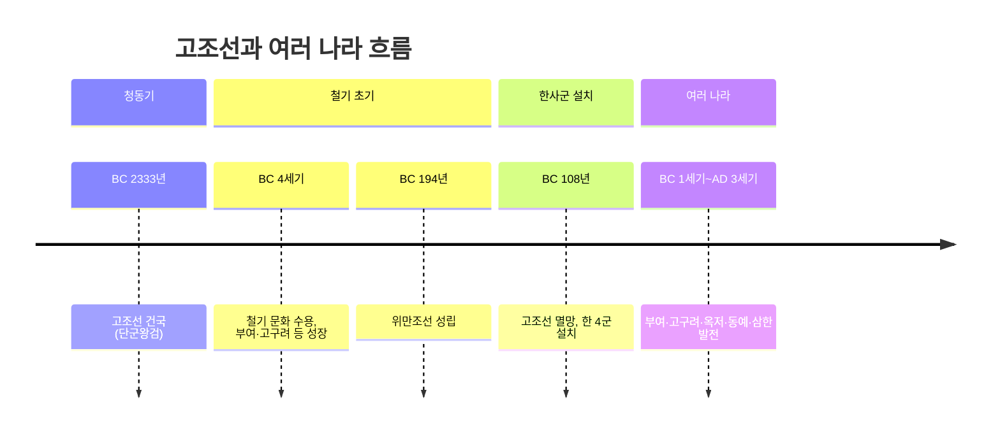

# 🏛️ 고조선과 여러 나라 — 한국사능력검정 고급 대비

> [!IMPORTANT]
> 이 자료는 한국사능력검정시험 **고급(1·2급)** 대비용으로 작성되었습니다.
> ⭐ 빈출 개념 / 🔴 핵심 개념을 중심으로 학습하세요.

---

## 1. 시대 개관

철기 문화가 보급되면서 한반도와 만주 일대에 여러 나라가 성장하였다. 이 시기의 국가들은 아직 왕권이 미약한 **연맹 왕국** 단계에 있었으며, 각 나라마다 독특한 풍습과 제천행사를 가지고 있었다.



> [!NOTE]
> 고조선 이후 한반도에는 부여·고구려(초기)·옥저·동예·삼한이 공존하며 각각 독자적인 문화를 발전시켰습니다.

---

## 2. 고조선 🔴

### 2-1. 건국과 의의

| 항목 | 내용 |
|------|------|
|**건국**| BC 2333년, 단군왕검 |
|**문화 기반**| 청동기 문화 (비파형 동검·고인돌 분포 = 세력 범위) |
|**건국 이념 **|** 홍익인간(弘益人間)**— "널리 인간 세상을 이롭게 하라" |
|**정치 형태 **|** 제정일치(祭政一致)**사회 |
|**사료**| 《삼국유사》(일연), 《동국통감》, 《제왕운기》 |

### 2-2. ⭐ 단군 신화의 역사적 의미

단군 신화는 단순한 전설이 아니라 당시의 사회상을 반영한 역사적 기록이다.

| 신화 요소 | 역사적 해석 |
|-----------|------------|
|**환인·환웅**(하늘 신) | 천손사상(天孫思想), 지배자의 신성성 강조 |
|**풍백·우사·운사 **| 바람·비·구름 관장 →** 농경 사회**임을 반영 |
| **웅녀(곰 → 여인)**| 곰 토템 부족과 천신 부족의** 연합**을 상징 |
| **호랑이의 실패**| 호랑이 토템 부족이 통합에서 탈락 |
|**단군왕검 **| '단군'=제사장, '왕검'=정치 지도자 →** 제정일치**|
|**홍익인간**| 인본주의적 건국 이념 |
|**1500년 통치 후 산신**| 오랜 역사성 강조 |

### 2-3. ⭐ 8조법 (八條禁法)

고조선은 사회 질서 유지를 위해 8가지 법을 제정하였으나, 현재는 《한서》 지리지에 **3개 조항** 만 전해진다.

| 조항 | 내용 | 역사적 의의 |
|------|------|------------|
| **제1조 **| 사람을 죽인 자는 즉시** 사형**에 처한다 | 생명 존중, 인명 보호 |
| **제2조 **| 남에게 상해를 입힌 자는** 곡물로 배상**한다 | 사유 재산 보호, 노동력 중시 |
| **제3조 **| 남의 물건을 훔친 자는** 노비 **로 삼되, 속죄하려면** 50만 전 **을 내야 한다 |** 계급 사회 **(노비 존재),** 사유 재산**확립 |

> [!IMPORTANT]
> 8조법의 의의: ① 생명 존중 ②**사유 재산 제도** 확립 ③**계급 사회 **(노비 존재) ④ 고조선이 법을 갖춘** 초기 국가**임을 증명

### 2-4. 위만조선 (BC 194 ~ BC 108) ⭐

**성립 **- BC 195년경: 한나라 출신의** 위만**이 고조선으로 망명
- BC 194년: 준왕을 몰아내고 **왕위 찬탈 **- 철기 문화를 본격적으로 수용하여 국력 강화** 특징 및 정책**| 항목 | 내용 |
|------|------|
|**철기 사용**| 철제 무기·농기구 수용 → 국력 비약적 성장 |
|**중계 무역**| 한(漢)과 진(辰, 남쪽 소국들) 사이에서 중계 무역으로 이익 독점 |
|**영토 확장**| 주변 소국 복속, 세력 확장 |
|**사신 파견 차단 **| 남쪽 진나라가 한과 직접 교역하는 것을 방해 |** 멸망 과정 **1. BC 109년:** 한 무제(漢 武帝)**침략 (육군+수군 동시 공격)
2. BC 108년: 왕검성 함락 →**고조선 멸망**- 내부 분열(화친파 vs 주전파)이 멸망 원인
3.**한 4군(漢四郡)** 설치

### 2-5. ⭐ 한 4군 (漢四郡)

| 군 | 위치 | 비고 |
|----|------|------|
|**낙랑군(樂浪郡)**| 평양 일대 | 가장 오래 존속, 313년 고구려 미천왕에 의해 축출 |
|**임둔군(臨屯郡)**| 함경도 방면 | 이후 현도·낙랑에 통합 |
|**진번군(眞番郡)**| 황해도 방면 | 이후 낙랑에 통합 |
|**현도군(玄菟郡)**| 압록강 상류 | 이후 만주 방면으로 이동 |

> [!NOTE]
> 한 4군은 이후 고구려 등의 저항으로 하나씩 소멸되었으며,**낙랑군** 이 가장 오래(313년까지) 존속하였다.

---

## 3. 부여 (夫餘) 🔴

### 3-1. 위치와 성격

| 항목 | 내용 |
|------|------|
| **위치**| 만주 송화강 유역 (지금의 중국 길림·흑룡강성 일대) |
|**성격 **| 5부족 연맹체 (왕 아래 마가·우가·저가·구가 =** 4출도**) |
| **전성기**| 1~3세기경 |
|**멸망**| 494년, 고구려 문자명왕에 의해 병합 |

### 3-2. ⭐ 정치·사회 제도

| 제도 | 내용 |
|------|------|
|**사출도(四出道)**| 왕 아래 마가·우가·저가·구가가 각각 일정 영역 통치 |
|**제가회의**| 귀족들의 합의체 → 국가 중대사 결정 |
|**1책12법(一責十二法)**| 12가지 죄목에 대한 엄중한 법 |
|**순장(殉葬)**| 왕이 죽으면 신하와 노비를 함께 매장 → 계급 사회 증거 |
|**연좌제**| 죄인의 가족도 함께 처벌 |
|**형사취수제**| 형이 죽으면 동생이 형수를 아내로 맞는 제도 |

### 3-3. ⭐ 제천행사 및 풍습

| 항목 | 내용 |
|------|------|
|**영고(迎鼓)**|** 12월**제천행사, 수렵 사회 전통 반영 |
|**순장**| 지배층의 무덤에 노비·신하 함께 매장 |
|**우제점복**| 소의 발굽으로 점을 침(전쟁 전) |
|**흰옷 선호**| 흰색 옷을 즐겨 입음 |

---

## 4. 고구려 초기 🔴

### 4-1. 건국과 초기 발전

| 항목 | 내용 |
|------|------|
|**건국**| BC 37년, 주몽(동명성왕), 졸본(환인 일대) |
|**성격**| 5부족 연맹체 (계루부·소노부·절노부·순노부·관노부) |
|**천도**| 국내성(집안) → 이후 평양(427년, 장수왕) |
|**왕권 강화**| 태조왕 때 계루부 고씨로 왕위 세습 고정 |

### 4-2. ⭐ 정치·사회 제도

| 제도 | 내용 |
|------|------|
|**제가회의**| 귀족 합의제 (부여와 유사) |
|**사자·조의·선인**| 하위 관리직 |
|**서옥제(婿屋制)**| 데릴사위제 — 혼인 후 처갓집에서 살다가 아이가 크면 남편 집으로 이동 |
|**부경(扶京)**| 약탈 창고 (부여의 동명성왕 고국천왕 정책에 대응) |

### 4-3. ⭐ 제천행사

| 항목 | 내용 |
|------|------|
|**동맹(東盟)**|** 10월**제천행사, 국동대혈에서 수신(隧神)에게 제사 |

---

## 5. 옥저 (沃沮) 🔴

### 5-1. 위치와 정치

| 항목 | 내용 |
|------|------|
|**위치**| 함경도 해안 지방 (동해안 일대) |
|**정치**| 왕 없음, 읍군(邑君)·삼로(三老)라는 군장이 통치 |
|**종속 관계**| 고구려에 복속, 공물 상납 |

### 5-2. ⭐ 특징적 풍습

| 풍습 | 내용 |
|------|------|
|**민며느리제**| 어릴 때 약혼한 여자아이를 남자 집에서 키우다가 성인이 되면 혼인 (조혼 풍습) |
|**골장제(骨藏制)**| 가족이 죽으면 임시 매장 후, 나중에 뼈를 꺼내** 가족 공동 무덤**에 안치 (목곽 사용) |
| **특산물**| 어물·소금·해산물 → 고구려에 공납 |

---

## 6. 동예 (東濊) 🔴

### 6-1. 위치와 정치

| 항목 | 내용 |
|------|------|
|**위치**| 강원도 북부 동해안 일대 |
|**정치**| 왕 없음, 읍군·삼로가 통치 |
|**종속 관계**| 고구려에 복속 |

### 6-2. ⭐ 특징적 풍습

| 풍습 | 내용 |
|------|------|
|**무천(舞天)**|** 10월**제천행사 — 하늘에 제사 지내며 노래와 춤 |
|**책화(責禍)**| 다른 부족의 영역 침범 시** 소·말로 배상**(강한 족외 영역 의식) |
|**족외혼**| 같은 씨족끼리 결혼 금지 |
|**특산물 **|** 단궁 **(짧은 활),** 과하마 **(키 작은 말),** 반어피**(바다표범 가죽) |

---

## 7. 삼한 (三韓) 🔴

### 7-1. 개관

한반도 남쪽에 위치한 세 부족 국가 연맹체.

| 나라 | 위치 | 훗날 발전 |
|------|------|-----------|
| **마한(馬韓)**| 경기·충청·전라 지방 | 백제로 발전 |
|**진한(辰韓)**| 경북 일대 | 신라로 발전 |
|**변한(弁韓)**| 경남 일대 | 가야로 발전 |

### 7-2. ⭐ 정치 제도 — 제정 분리

| 직책 | 역할 |
|------|------|
|**신지(臣智)**| 최고 군장 (정치·군사 담당) |
|**읍차(邑借)**| 하위 군장 |
|**천군(天君)**| 제사장 (종교 담당) |
|**소도(蘇塗)**| 천군이 관할하는 신성 구역 (군장의 세력이 미치지 못함) |

> [!IMPORTANT]
>**소도의 의미 **: 죄인이 소도로 도망치면 군장도 잡을 수 없음 →** 제정 분리**의 상징
> 소도에는 큰 나무를 세우고 방울과 북을 달아 놓음 → 경계 표시

### 7-3. ⭐ 경제·문화

| 항목 | 내용 |
|------|------|
| **벼농사**| 철제 농기구 사용, 저습지 이용 |
|**철 생산(변한)**| 변한에서 철이 많이 생산됨 →** 낙랑군·왜(일본)**에 수출, 덩이쇠(철)를** 화폐처럼**사용 |
|**두레**| 공동 노동 조직 |
|**제천행사 **|** 5월(파종 후)·10월(추수 후)**계절제 |
|**마한의 특징**| 54개 소국 연맹, 가장 규모 큼 |

### 7-4. 두레와 계절 제천

-**5월 제천**: 씨뿌리기(파종) 후 → 풍년 기원
- **10월 제천**: 추수 후 → 수확 감사
- 이 때 음주·가무 성행 → 농경 공동체 문화

---

## 8. 여러 나라 비교표 ⭐ 빈출

| 나라 | 위치 | 제천행사 | 주요 풍습 | 특산물 |
|------|------|----------|-----------|--------|
| **부여 **| 만주 송화강 |** 영고**(12월) | 순장, 1책12법, 연좌제, 형사취수제, 사출도 | 말·모피·주옥 |
| **고구려 **| 압록강 중류 |** 동맹**(10월) | 서옥제(데릴사위제), 제가회의, 부경 | — |
| **옥저**| 함경도 해안 | 없음 | 민며느리제, 골장제(가족공동묘) | 어물·소금 |
|**동예 **| 강원 북부 |** 무천**(10월) | 책화, 족외혼 | 단궁·과하마·반어피 |
| **삼한 **| 한반도 남부 |** 5월·10월**| 소도(천군), 제정분리 | 변한의 철 |

---

## 9. ⭐ 빈출 개념

### 제천행사 암기법

```
부여 → 영고 → 12월   (부(12) : 부여는 12월)
고구려 → 동맹 → 10월
동예  → 무천 → 10월
삼한  → 계절제 → 5월, 10월 (두 번!)
```

### 혼인 풍습 비교

| 풍습 | 나라 | 내용 |
|------|------|------|
|**서옥제**| 고구려 | 혼인 후 처갓집 거주, 아이 크면 귀가 |
|**민며느리제**| 옥저 | 어릴 때 남자 집에서 키워 성인이 되면 혼인 |
|**형사취수제**| 부여 | 형 사망 시 동생이 형수와 혼인 |

### 소도 vs 제정일치 vs 제정분리

| 구분 | 내용 |
|------|------|
|**제정일치**| 고조선(단군왕검) — 정치+종교 같은 사람이 담당 |
|**제정분리**| 삼한 — 군장(정치)과 천군(제사) 분리 |
|**소도**| 천군의 신성 구역, 군장 권력 미치지 않음 |

---

## 10. 🔴 핵심 개념 요약

1.**고조선**: BC 2333년 단군왕검, 홍익인간, 8조법(3개 전해짐), 위만조선(BC 194)→멸망(BC 108)→한 4군
2. **8조법**: 사형·배상·노비 → 생명 존중 + 사유 재산 + 계급 사회 증거
3. **부여**: 영고(12월), 사출도, 순장, 1책12법, 형사취수제
4. **고구려**: 동맹(10월), 서옥제, 제가회의
5. **옥저**: 민며느리제, 골장제 (왕 없음)
6. **동예**: 무천(10월), 책화, 족외혼, 단궁·과하마·반어피 (왕 없음)
7. **삼한**: 5월·10월 제천, 소도·천군(제정분리), 변한 철 수출
8. **한 4군**: 낙랑·임둔·진번·현도 → 낙랑이 가장 오래 존속(313년까지)

---

## 11. 연표

| 시기 | 사건 |
|------|------|
| **BC 2333년**| 단군왕검 — 고조선 건국 (《삼국유사》 기록) |
|**BC 4세기**| 부여·고구려 등 철기 문화 수용, 성장 시작 |
|**BC 194년 **| 위만, 준왕 축출 →** 위만조선**성립 |
|**BC 109년**| 한 무제 침략 |
|**BC 108년 **| 고조선 멸망 →** 한 4군**설치 |
|**BC 82년**| 임둔·진번 소멸 |
|**BC 75년**| 현도군 이동(고구려 저항) |
|**BC 37년**| 주몽 — 고구려 건국 |
|**BC 18년**| 온조 — 백제 건국 |
|**AD 313년**| 고구려 미천왕 — 낙랑군 축출 |
|**AD 314년**| 고구려 미천왕 — 대방군 축출 |
|**AD 494년** | 부여 — 고구려에 병합 |

---

## 12. 참고 출처 URL

| 출처 | URL |
|------|-----|
| 한국민족문화대백과 — 고조선 | https://encykorea.aks.ac.kr/Article/E0003296 |
| 한국민족문화대백과 — 단군신화 | https://encykorea.aks.ac.kr/Article/E0013847 |
| 국사편찬위원회 한국사데이터베이스 | https://db.history.go.kr |
| 한국민족문화대백과 — 부여 | https://encykorea.aks.ac.kr/Article/E0024195 |
| 한국민족문화대백과 — 삼한 | https://encykorea.aks.ac.kr/Article/E0027271 |
| 한국사능력검정시험 공식 사이트 | https://www.historyexam.go.kr |
| 국립중앙박물관 | https://www.museum.go.kr |

---

*작성 기준: 한국사능력검정시험 고급(1·2급) 출제 범위 및 수준*
*최종 업데이트: 2026년 5월*
