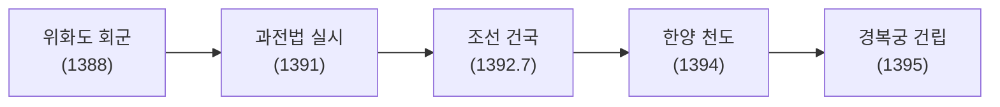
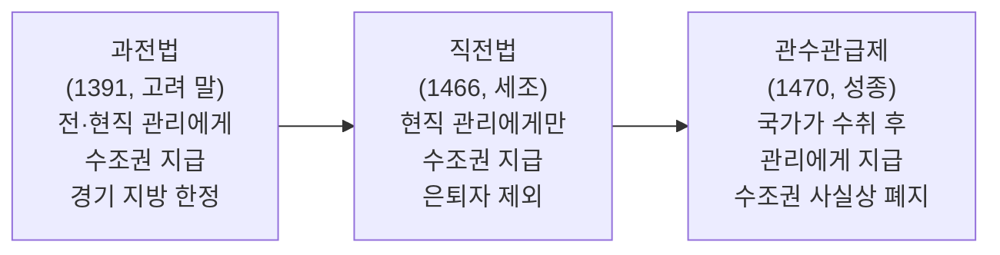
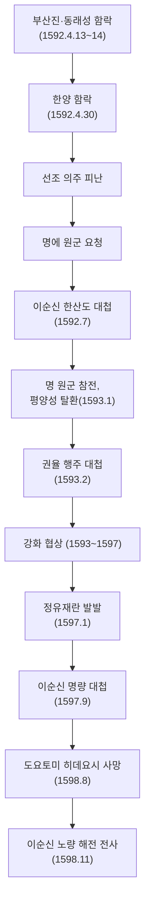

# 조선 전기 (1392~1592)

> 한국사능력검정시험 심화(고급) 대비 학습자료

---

## 1. 시대 개관

조선은 1392년 이성계가 건국하여 1897년 대한제국 선포 전까지 약 500년간 지속된 왕조이다. 성리학을 통치 이념으로 삼았으며, 유교적 민본 정치와 문치주의를 표방하였다. 조선 전기(1392~1592)는 건국 초기의 제도 정비 시기부터 임진왜란 발발 전까지의 시기를 가리킨다.

**시대적 특징**

- 성리학적 통치 질서 확립 (경국대전 완성)
- 훈구파 중심 정치 → 사림파 성장 → 사화(士禍)
- 중앙 집권 체제 강화, 관료제 정비
- 과전법 → 직전법 → 관수관급제로 이어지는 토지 제도 변화
- 임진왜란(1592)으로 전기 종결

---

## 2. 건국 과정

| 연도      | 사건            | 내용                                               |
| --------- | --------------- | -------------------------------------------------- |
| 1388      | 위화도 회군     | 이성계, 요동 정벌 거부 → 군사 쿠데타, 우왕 폐위    |
| 1388~1391 | 전제 개혁       | 신진 사대부·이성계 연합, 사전(私田) 혁파 추진      |
| 1391      | **과전법 실시** | 경기 지방 토지에 한해 전·현직 관리에게 수조권 지급 |
| 1392      | **조선 건국**   | 공양왕 폐위, 이성계 즉위 (7월 17일)                |
| 1394      | 한양 천도       | 개경 → 한양 (지금의 서울)                          |
| 1395      | 경복궁 건립     | 정도전이 설계, 조선 왕조의 법궁                    |

> [!NOTE]
> **과전법(1391)**은 고려 말 권문세족의 토지 겸병을 해소하고 신진 사대부의 경제적 기반을 마련하기 위해 실시되었다. 지급 대상 토지는 **경기 지방**에 한정하였다.

---

## 3. 왕별 정책 (조선 전기)

### 🔴 태조 (1392~1398, 제1대)

| 분야 | 내용                                                       |
| ---- | ---------------------------------------------------------- |
| 도읍 | 한양 천도(1394), 경복궁·종묘·사직 건립                     |
| 제도 | 정도전 주도 – 조선경국전, 경제문감 편찬                    |
| 천문 | 천상열차분야지도 제작 (고구려 석각 천문도 참조)            |
| 사건 | **1차 왕자의 난(1398)** – 이방원이 세자 이방석·정도전 제거 |

### 정종 (1398~1400, 제2대)

| 분야 | 내용                                       |
| ---- | ------------------------------------------ |
| 사건 | **2차 왕자의 난(1400)** – 이방원 vs 이방간 |
| 도읍 | 개성 환도 (한양 → 개성)                    |
| 기타 | 도평의사사 → **의정부**로 개칭             |

### 🔴 태종 (1400~1418, 제3대)

> **핵심 키워드**: 6조직계제, 사병 혁파, 호패법, 신문고, 양전사업, 외척 숙청

| 분야      | 정책                 | 설명                                             |
| --------- | -------------------- | ------------------------------------------------ |
| 왕권 강화 | **6조직계제** 실시   | 6조 판서가 의정부를 거치지 않고 왕에게 직접 보고 |
| 왕권 강화 | 사병 혁파            | 공신·왕족의 사병을 국가 군대로 편입              |
| 왕권 강화 | 외척 세력 숙청       | 왕비 민씨 집안 숙청                              |
| 언론      | 사간원 독립          | 사간원을 문하부에서 분리, 독립 관청으로 설치     |
| 민생      | **신문고 설치**      | 백성이 억울함을 왕에게 직접 호소하는 제도        |
| 경제      | **호패법**           | 16세 이상 남성에게 신분증(호패) 발급 → 인구 파악 |
| 경제      | **양전사업**         | 전국 토지 조사 → 조세 기반 확보                  |
| 문화      | 주자소 설치          | 계미자(금속활자) 주조                            |
| 문화      | 혼일강리역대국도지도 | 동양 최고(最古)의 세계 지도                      |

### ⭐🔴 세종 (1418~1450, 제4대)

> **핵심 키워드**: 의정부서사제, 집현전, 훈민정음, 4군 6진, 측우기·자격루·앙부일구

| 분야 | 정책                               | 내용                                                  |
| ---- | ---------------------------------- | ----------------------------------------------------- |
| 정치 | **의정부서사제** 실시              | 6조 → 의정부 → 왕 결재 (왕권·신권 조화)               |
| 정치 | 집현전 설치                        | 학문 연구 기관, 뛰어난 신하 등용                      |
| 영토 | **4군 6진** 개척                   | 최윤덕(4군, 북서), 김종서(6진, 북동) → 현재 국경 확정 |
| 영토 | 쓰시마 정벌(1419)                  | 이종무가 대마도(쓰시마) 정벌, 왜구 소탕               |
| 문자 | **훈민정음 창제(1443)·반포(1446)** | 백성을 위한 문자 창제                                 |
| 과학 | 측우기                             | 강우량 측정                                           |
| 과학 | 자격루                             | 자동으로 시간 알리는 물시계                           |
| 과학 | 앙부일구                           | 해시계                                                |
| 과학 | 혼천의                             | 천체 운행 관측기구                                    |
| 과학 | 칠정산                             | 조선 실정에 맞는 역법서                               |
| 편찬 | 농사직설                           | 우리 풍토에 맞는 농법 정리                            |
| 편찬 | 향약집성방                         | 조선 의학 정리                                        |
| 편찬 | 삼강행실도                         | 유교 윤리 교화서                                      |
| 편찬 | 정간보                             | 음악 악보 체계 정립                                   |

### 문종·단종 (1450~1455)

- 문종(1450~1452): 재위 2년, 허약한 왕권
- 단종(1452~1455): 어린 나이에 즉위 → 왕권 불안정
- **계유정난(1453)**: 수양대군(세조)이 황보인·김종서 등 제거, 권력 장악

### 🔴 세조 (1455~1468, 제7대)

> **핵심 키워드**: 6조직계제 부활, 직전법, 집현전 폐지, 경국대전 편찬 시작

| 분야      | 정책                    | 내용                                      |
| --------- | ----------------------- | ----------------------------------------- |
| 왕권 강화 | **6조직계제 부활**      | 태종의 제도 부활, 강력한 왕권 행사        |
| 왕권 강화 | 집현전·경연 폐지        | 신하들의 권한 약화                        |
| 경제      | **직전법(1466)**        | 현직 관리에게만 수조권 지급 (은퇴자 제외) |
| 법전      | **경국대전 편찬 시작**  | 조선 최고의 법전, 성종 때 완성            |
| 반란      | 이시애의 난(1467)       | 함경도 세력의 반란, 진압 후 유향소 폐지   |
| 문화      | 원각사지 10층 석탑 건립 | 서울 탑골공원, 대리석 탑                  |

### 🔴 성종 (1469~1494, 제9대)

> **핵심 키워드**: 경국대전 완성, 홍문관 설치, 관수관급제, 사림 등용

| 분야 | 정책                    | 내용                                                 |
| ---- | ----------------------- | ---------------------------------------------------- |
| 법전 | **경국대전 완성(1485)** | 조선 법치 체제 완비, 이·호·예·병·형·공전 6전         |
| 언론 | **홍문관 설치**         | 집현전 기능 계승, 3사(사헌부·사간원·홍문관) 완성     |
| 경제 | **관수관급제(1470)**    | 국가가 세금 수취 후 관리에게 지급 → 수조권 폐단 해소 |
| 정치 | 사림 등용               | 훈구 세력 견제 위해 사림 진출 허용                   |
| 편찬 | 동국여지승람            | 전국 지리서                                          |
| 편찬 | 동국통감                | 고조선~고려 역사서                                   |
| 편찬 | 악학궤범                | 음악 이론서                                          |

### 연산군 (1494~1506, 제10대)

| 사화         | 연도 | 원인                                        | 피해자              |
| ------------ | ---- | ------------------------------------------- | ------------------- |
| **무오사화** | 1498 | 김종직의 '조의제문' (세조를 항우에 빗댄 글) | 사림 대거 숙청      |
| **갑자사화** | 1504 | 연산군 생모 폐비 윤씨 관련                  | 훈구·사림 모두 피해 |

- **중종반정(1506)**: 훈구 세력이 연산군 폐위 → 중종 옹립

### 중종 (1506~1544, 제11대)

- **조광조의 개혁 정치**: 소격서 폐지, 현량과 실시, 위훈삭제(공신 자격 박탈 추진)
- **기묘사화(1519)**: 훈구 세력이 조광조 일파 제거 (주초위왕(走肖爲王) 사건)

### 명종 (1545~1567, 제13대)

- **을사사화(1545)**: 외척 대윤(인종 외가)과 소윤(명종 외가) 권력 다툼 → 사림 피해
- **비변사 설치**: 왜구·여진 대비 임시 합의 기구 (이후 상설화)
- 임꺽정 봉기(1559~1562): 황해도 도적 봉기, 지배층 수탈에 저항

### 선조 (1567~1608, 제14대)

- 사림의 중앙 정계 완전 장악
- 동인·서인으로 붕당 분열 (1575)
- **임진왜란(1592) → 정유재란(1597)**

---

## 4. 중앙 정치 제도

### 주요 관청

| 관청       | 기능                                             |
| ---------- | ------------------------------------------------ |
| **의정부** | 최고 행정 기구 (영의정·좌의정·우의정)            |
| **6조**    | 이·호·예·병·형·공조 – 실무 행정 부처             |
| **사헌부** | 관리 감찰, 탄핵 (3사 중 하나)                    |
| **사간원** | 왕의 잘못 간쟁, 정책 비판 (3사 중 하나)          |
| **홍문관** | 왕의 자문, 경연 주관 (3사 중 하나, 성종 때 설치) |
| **의금부** | 왕의 직속 사법 기관, 중죄인 처벌                 |
| **한성부** | 수도 서울의 행정 관청                            |
| **춘추관** | 역사 편찬 기관                                   |
| **승정원** | 왕의 비서 기관, 왕명 출납                        |

### ⭐ 6조직계제 vs 의정부서사제 비교

| 구분      | **6조직계제**            | **의정부서사제**      |
| --------- | ------------------------ | --------------------- |
| 보고 체계 | 6조 → **왕** (직접 보고) | 6조 → **의정부** → 왕 |
| 목적      | 왕권 강화                | 왕권·신권 조화        |
| 시행 왕   | **태종, 세조**           | **세종**              |
| 특징      | 신하(의정부) 권한 약화   | 재상의 권한 강화      |

---

## 5. 지방 제도

- **8도**: 경기·충청·전라·경상·강원·황해·평안·함경
- **부·목·군·현** 체계: 관찰사(도), 부윤/목사/군수/현령(지방관)
- **향리**: 지방 행정 실무 담당, 중앙 파견 관리 보좌
- **유향소(향청)**: 지방 자치 기구, 향리 감시
- **경재소**: 중앙에서 유향소 통제하는 기구

---

## 6. 군사 제도

| 제도         | 내용                                      |
| ------------ | ----------------------------------------- |
| **5위**      | 중앙군 (의흥·용양·호분·忠佐·忠武위)       |
| **진관체제** | 지방 방어 체제, 각 지역이 독립적으로 방어 |
| **잡색군**   | 지방 예비 병력 (향리, 노비 등)            |

---

## 7. 수취 제도

| 항목           | 내용                                                       |
| -------------- | ---------------------------------------------------------- |
| **전세(조세)** | 토지 1결당 세금 수취, 세종 때 공법(전분6등·연분9등법) 제정 |
| **공납**       | 지역 특산물 납부 → 방납 폐단 심화                          |
| **역(役)**     | 16~60세 정남이 군역·요역 부담                              |

---

## 8. ⭐ 토지 제도 변화 (과전법 → 직전법 → 관수관급제)

| 구분             | 과전법 (1391)          | 직전법 (1466)             | 관수관급제 (1470)     |
| ---------------- | ---------------------- | ------------------------- | --------------------- |
| 수조권 지급 대상 | 전·현직 관리           | **현직 관리만**           | (수조권 국가 환수)    |
| 수취 주체        | 관리(사적)             | 관리(사적)                | **국가**              |
| 배경             | 고려 말 토지 문란 해소 | 토지 부족, 과전 세습 문제 | 관리의 불법 수탈 방지 |
| 의의             | 신진 사대부 기반 마련  | 국가 토지 지배력 강화     | 국가 재정 집중화      |

---

## 9. ⭐ 훈구파 vs 사림파 비교

| 구분      | **훈구파**              | **사림파**                      |
| --------- | ----------------------- | ------------------------------- |
| 형성      | 세조 계유정난 공신 중심 | 고려 말 온건 개혁파 사대부 계승 |
| 기반      | 중앙 관직, 대농장       | 지방 향촌, 서원·향약            |
| 사상      | 현실주의, 부국강병      | 성리학 원칙, 왕도 정치          |
| 정치 성향 | 왕권 지지, 친명 외교    | 훈구 비판, 도덕 정치 강조       |
| 경제      | 농장 확대, 토지 겸병    | 중소 지주                       |
| 주요 인물 | 정인지, 신숙주, 한명회  | 김종직, 조광조, 이황, 이이      |
| 등장 시기 | 세조 이후               | 성종 때 중앙 진출               |

---

## 10. ⭐ 4대 사화 비교표

| 사화         | 연도 | 왕     | 원인                       | 피해 세력 | 주요 내용                           |
| ------------ | ---- | ------ | -------------------------- | --------- | ----------------------------------- |
| **무오사화** | 1498 | 연산군 | 김종직의 '조의제문'        | 사림      | 훈구가 사림 탄압, 김종직 부관참시   |
| **갑자사화** | 1504 | 연산군 | 폐비 윤씨 복위 문제        | 훈구+사림 | 연산군의 폭정, 폭넓은 숙청          |
| **기묘사화** | 1519 | 중종   | 조광조 급진 개혁(위훈삭제) | 사림      | 조광조 사사, 현량과 폐지            |
| **을사사화** | 1545 | 명종   | 외척 대윤·소윤 권력 다툼   | 사림      | 윤임(대윤) 세력 제거, 문정왕후 섭정 |

> [!IMPORTANT]
> **을사사화(1545)** 이후 사림은 일시적 위축을 겪었으나, 서원과 향약을 기반으로 지방에서 세력을 유지하여 **선조 이후** 중앙 정계를 장악하게 된다.

---

## 11. ⭐ 임진왜란 (1592~1598)

### 배경

- 일본 도요토미 히데요시의 전국 통일(1590) → 조선 침략 야욕
- 조선의 국방 태세 허술 (분당 정쟁, 진관체제 유명무실)
- 명 침략을 위한 가도(假道) 요청 거부

### 전개 과정

### 주요 전투

| 전투        | 연도    | 지휘관     | 내용                                  |
| ----------- | ------- | ---------- | ------------------------------------- |
| 한산도 대첩 | 1592.7  | **이순신** | 학익진 전술, 일본 수군 대파           |
| 행주 대첩   | 1593.2  | **권율**   | 행주산성 방어전, 행주치마 유래        |
| 진주 대첩   | 1592.10 | **김시민** | 진주성 방어, 3800명이 2만 일본군 격퇴 |
| 명량 대첩   | 1597.9  | **이순신** | 13척으로 133척 격파, 조선 수군 재건   |
| 노량 해전   | 1598.11 | **이순신** | 퇴각하는 일본군 격파, 이순신 전사     |

### 의병 활동

| 의병장                | 활동 지역          |
| --------------------- | ------------------ |
| **곽재우** (홍의장군) | 경상도 의령        |
| **조헌**              | 충청도 (금산 전투) |
| **고경명**            | 전라도             |
| **유정(사명대사)**    | 승병 조직          |
| **휴정(서산대사)**    | 승병 조직          |

### 임진왜란의 결과

| 구분 | 내용                                              |
| ---- | ------------------------------------------------- |
| 조선 | 인구 감소, 농경지 황폐, 문화재 약탈, 경복궁 소실  |
| 명   | 군사력·재정 소모로 국력 약화 → 청에 의해 멸망     |
| 일본 | 도요토미 정권 붕괴 → 도쿠가와 에도막부 수립(1603) |
| 여진 | 명·조선 약화 틈타 성장 → 후금 건국(1616)          |

---

## 12. 세종대 과학·문화 업적 정리

| 분야 | 업적                             | 의의                     |
| ---- | -------------------------------- | ------------------------ |
| 문자 | 훈민정음(1443 창제, 1446 반포)   | 우리 고유 문자 체계      |
| 과학 | 측우기, 자격루, 앙부일구, 혼천의 | 농업·천문 발전           |
| 역법 | 칠정산                           | 조선 자체 천문 역법      |
| 농업 | 농사직설                         | 우리 풍토 적합 농법 정리 |
| 의학 | 향약집성방                       | 국산 약재 활용 의학서    |
| 음악 | 정간보                           | 한국 최초의 유량 악보    |
| 윤리 | 삼강행실도                       | 충·효·열 교화            |
| 지리 | 팔도지리지                       | 전국 지리 정보           |

---

## 13. ⭐ 빈출·핵심 개념 정리

> [!TIP]
> **자주 출제되는 비교 포인트**

- ⭐ **6조직계제(태종·세조) vs 의정부서사제(세종)** → 왕권 강화 vs 신권 존중
- ⭐ **과전법(1391) → 직전법(1466) → 관수관급제(1470)** → 국가 토지 지배력 강화 과정
- ⭐ **집현전(세종 설치) vs 홍문관(성종 설치)** → 세조가 집현전 폐지
- ⭐ **경국대전**: 세조 편찬 시작 → 성종(1485) 완성·반포
- ⭐ **4대 사화 순서**: 무오(1498) → 갑자(1504) → 기묘(1519) → 을사(1545)
- 🔴 **훈민정음**: 창제(1443)와 반포(1446) 연도 구분 필수
- 🔴 **이순신 3대 대첩**: 한산도(1592.7) · 명량(1597.9) · 노량(1598.11)
- 🔴 **쓰시마 정벌(1419)**: 이종무 지휘, 세종 대
- 🔴 **4군(최윤덕)·6진(김종서)**: 세종 대 북방 영토 확장

---

## 14. 연표

| 연도 | 사건                              |
| ---- | --------------------------------- |
| 1388 | 위화도 회군                       |
| 1391 | 과전법 실시                       |
| 1392 | 조선 건국 (태조)                  |
| 1394 | 한양 천도                         |
| 1398 | 1차 왕자의 난                     |
| 1400 | 2차 왕자의 난, 태종 즉위          |
| 1419 | 이종무 쓰시마 정벌 (세종)         |
| 1420 | 집현전 확대 설치 (세종)           |
| 1443 | 훈민정음 창제 (세종)              |
| 1446 | 훈민정음 반포 (세종)              |
| 1453 | 계유정난 (수양대군)               |
| 1455 | 세조 즉위                         |
| 1466 | 직전법 실시 (세조)                |
| 1470 | 관수관급제 (성종)                 |
| 1485 | 경국대전 완성 (성종)              |
| 1498 | 무오사화 (연산군)                 |
| 1504 | 갑자사화 (연산군)                 |
| 1506 | 중종반정                          |
| 1519 | 기묘사화 (중종), 조광조 사사      |
| 1545 | 을사사화 (명종)                   |
| 1592 | 임진왜란 발발, 한산도 대첩        |
| 1593 | 행주 대첩, 평양성 탈환            |
| 1597 | 정유재란, 명량 대첩               |
| 1598 | 노량 해전, 이순신 전사, 왜란 종료 |

---

## 참고 출처

- 한국민족문화대백과사전: https://encykorea.aks.ac.kr
- 국사편찬위원회 한국사데이터베이스: https://db.history.go.kr
- 한국사능력검정시험 공식 홈페이지: https://www.historyexam.go.kr
- 국립중앙박물관: https://www.museum.go.kr
- 문화재청 국가유산포털: https://www.heritage.go.kr
