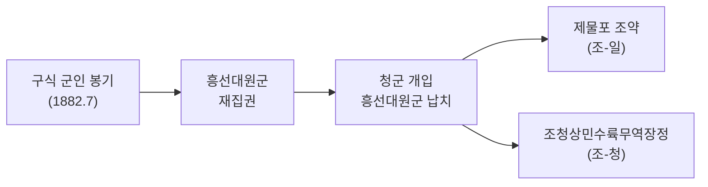
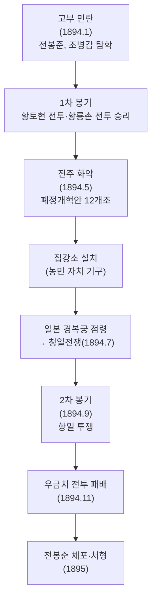
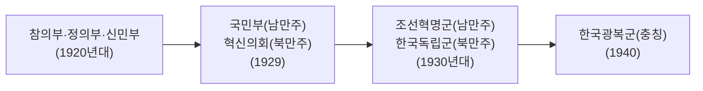

# 개항기·대한제국·일제강점기 (1876~1945)

> 한국사능력검정시험 심화(고급) 대비 학습자료

---

## 1. 시대 개관

1876년 강화도 조약으로 조선이 개항하면서 근대 세계와 마주하게 되었다. 이후 개화 정책 추진, 임오군란·갑신정변·동학농민운동을 거쳐 갑오개혁으로 근대적 제도가 도입되었다. 대한제국 수립(1897) 후 자주적 근대화를 시도하였으나 을사늑약(1905)으로 외교권을 빼앗기고 1910년 국권이 피탈되었다. 이후 1945년 광복까지 일제 식민 통치에 맞선 독립운동이 전개되었다.

**시대적 특징**

- 개항(1876) → 갑오개혁(1894) → 대한제국(1897) → 국권 피탈(1910)
- 일제의 3단계 통치: 무단 통치 → 문화 통치 → 민족 말살 통치
- 국내외 다양한 형태의 독립운동 전개
- 임시정부, 무장 독립 투쟁, 실력양성운동, 사회주의 운동

---

## 2. 개항기

### 강화도 조약 (1876)

> **핵심**: 최초의 근대적 조약, 불평등 조약

| 항목        | 내용                                                   |
| ----------- | ------------------------------------------------------ |
| 정식 명칭   | 조일수호조규 (丙子修好條規)                            |
| 배경        | **운요호 사건(1875)** – 일본 군함의 강화도 무력 도발   |
| 핵심 내용   | 조선은 자주국임을 명시, 부산·원산·인천 3개 항구 개항   |
| 불평등 내용 | **치외법권(영사재판권)**, 일본의 해안 측량권 허용      |
| 추가 조약   | 조일수호조규부록, 조일무역규칙 (무관세·양곡 유출 허용) |

### 주요 수호 통상 조약

| 국가     | 조약명               | 연도     | 특징                                  |
| -------- | -------------------- | -------- | ------------------------------------- |
| 일본     | 조일수호조규         | 1876     | 최초 근대 조약, 치외법권·해안 측량권  |
| **미국** | 조미수호통상조약     | **1882** | **최혜국 대우**, **거중조정** 조항    |
| 영국     | 조영수호통상조약     | 1883     | –                                     |
| 청       | 조청상민수륙무역장정 | 1882     | 임오군란 이후, 청 상인 내지 통상 허용 |

### 개화 정책 기구 및 사절단

| 기구/사절단      | 연도       | 내용                                      |
| ---------------- | ---------- | ----------------------------------------- |
| **통리기무아문** | 1880       | 개화 정책 총괄 기구                       |
| **별기군**       | 1881       | 신식 군대 (일본인 교관 훈련)              |
| **수신사**       | 1876, 1880 | 일본에 파견, 개화 문물 시찰               |
| **영선사**       | 1881       | 청에 파견, 근대 무기 제조법 습득 (김윤식) |
| **보빙사**       | 1883       | 미국에 파견, 서양 문물 시찰 (민영익 등)   |

### ⭐ 임오군란 (1882)

> **원인**: 구식 군인에 대한 차별 대우 (별기군 vs 구식 군대 급료 차이)

| 조약                             | 내용                                          |
| -------------------------------- | --------------------------------------------- |
| **제물포 조약** (조-일)          | 일본 공사관 경비병 주둔 허용, 배상금 지불     |
| **조청상민수륙무역장정** (조-청) | 청 상인의 내지 통상 허용, 청의 내정 간섭 강화 |

### ⭐ 갑신정변 (1884)

> **성격**: 급진 개화파의 정변, 최초의 근대적 정치 개혁 운동

| 항목      | 내용                                                                                  |
| --------- | ------------------------------------------------------------------------------------- |
| 주도 세력 | **김옥균·박영효·서광범·홍영식** (급진 개화파)                                         |
| 계기      | 우정총국 개국 축하연(1884.12.4) 이용                                                  |
| 강령      | **14개조 개혁안**: 청에 대한 조공 허례 폐지, 인민 평등권, 지조법 개혁, 내각제 설치 등 |
| 실패 원인 | 청군의 개입 → **3일 천하**                                                            |

| 결과 조약             | 내용                                                                |
| --------------------- | ------------------------------------------------------------------- |
| **한성 조약** (조-일) | 배상금 지불, 일본 공사관 신축비                                     |
| **톈진 조약** (청-일) | 조선에서 양국 군대 동시 철수, 파병 시 상호 통보 → **청일전쟁 빌미** |

### ⭐ 동학농민운동 (1894)

**폐정개혁안 12개조** (전주화약 당시 집강소 운영 기준)

- 탐관오리 처벌, 불량 유생·아전 처벌
- 노비 문서 소각, 칠반 천민(백정 등) 차별 철폐
- 청상 과부 재가 허용
- 무명 잡세 폐지, 토지 균등 분배

### 갑오개혁 (1894~1895)

| 구분 | 1차 갑오개혁 (1894)              | 2차 갑오개혁 (1894~1895)   |
| ---- | -------------------------------- | -------------------------- |
| 기구 | **군국기무처** 설치              | 군국기무처 폐지, 홍범 14조 |
| 정치 | 사법·행정 분리                   | 지방 8도 → 23부 개편       |
| 사회 | **과거제 폐지**, **신분제 폐지** | 재판소 설치                |
| 경제 | 은본위제, 조세 금납화            | 도량형 통일                |

### 을미개혁과 을미의병 (1895)

- **을미사변(1895.8)**: 일본이 명성황후(민비) 시해 → 친일 내각 수립
- **을미개혁**: 태양력 사용, **단발령** 시행
- **을미의병**: 단발령·을미사변에 분노한 유생·농민 봉기 (유인석·이소응 등)

---

## 3. 대한제국

### 아관파천과 독립협회

| 사건                   | 연도 | 내용                                         |
| ---------------------- | ---- | -------------------------------------------- |
| **아관파천**           | 1896 | 고종이 러시아 공사관으로 피신 (1년간)        |
| **독립신문** 창간      | 1896 | 서재필, 한글·영문 발행                       |
| **독립협회** 창립      | 1896 | 서재필·이상재·윤치호                         |
| **독립문** 건립        | 1897 | 중국 사신 맞던 영은문 자리에 건립            |
| **만민공동회**         | 1898 | 이권 수호 운동, 러시아 절영도 조차 요구 거부 |
| **관민공동회·헌의6조** | 1898 | 정부 관료+독립협회, 의회 설립 요구           |

**헌의6조** (관민공동회 결의)

1. 외국인에게 의지하지 말 것
2. 외국과의 조약은 각부 대신과 중추원 의장이 함께 서명
3. 재정은 탁지부에서 전관
4. 중대 범죄는 공판, 피고 권리 보장
5. 칙임관은 황제가 의정부에 자문하여 임명
6. 정해진 규정 시행

### 대한제국 수립 (1897)

- 고종, 러시아 공사관에서 환궁(1897.2)
- **대한제국 선포(1897.10)**: 광무(光武) 연호 사용
- **대한국 국제(大韓國國制) 반포**: 전제 황권 명시

### 광무개혁

| 분야 | 내용                                                     |
| ---- | -------------------------------------------------------- |
| 토지 | **지계(地契) 발급** – 토지 소유권 증명서 발급            |
| 토지 | **양전 사업** – 전국 토지 측량                           |
| 군사 | **원수부** 설치 – 황제 직속 최고 군사 기관               |
| 교육 | 실업학교·기술학교 설립                                   |
| 경제 | 근대 공장·회사 설립 지원                                 |
| 원칙 | **구본신참(舊本新參)** – 옛 제도를 본으로 하고 새것 참고 |

### 국권 피탈 과정

| 조약/사건                  | 연도          | 내용                                                      |
| -------------------------- | ------------- | --------------------------------------------------------- |
| 한일의정서                 | 1904.2        | 군사 요지 사용권                                          |
| **제1차 한일협약**         | 1904.8        | 재정·외교 고문 파견                                       |
| **을사늑약(을사5조약)**    | **1905.11**   | **외교권 박탈**, **통감부 설치**, 이토 히로부미 초대 통감 |
| **헤이그 특사**            | **1907**      | 이준·이상설·이위종 파견 → 고종 강제 퇴위                  |
| 한일신협약(정미7조약)      | 1907.7        | 차관 정치, 군대 해산                                      |
| **기유각서**               | 1909          | 사법권 박탈                                               |
| **경술국치(한일병합조약)** | **1910.8.29** | 국권 완전 피탈                                            |

> [!IMPORTANT]
> **을사늑약(1905)**: 고종의 서명 없이 강제 체결 → 무효 주장. 황성신문 '시일야방성대곡(장지연)', 매국 을사오적(이완용·박제순·이지용·이근택·권중현) 규탄

**항일 의거**

- 최익현: 태인 의병(1906)
- 민영환·조병세: 자결 순국
- 나철: 단군교(대종교) 창시(1909)
- 안중근: 이토 히로부미 사살(1909.10, 하얼빈)

---

## 4. 일제 식민 통치 3단계

### ⭐ 비교표

| 구분      | **무단 통치**     | **문화 통치**             | **민족 말살 통치**      |
| --------- | ----------------- | ------------------------- | ----------------------- |
| 시기      | 1910년대          | 1920년대                  | 1930~1945               |
| 배경      | 국권 피탈 직후    | 3.1 운동 이후             | 중일전쟁(1937) 이후     |
| 통치 방식 | 헌병 경찰제       | 보통 경찰제               | 황국신민화 정책         |
| 특징      | 즉결 처분권, 태형 | 기만적 유화책             | 민족 정체성 말살        |
| 경제 정책 | 토지조사사업      | 산미증식계획, 회사령 폐지 | 국가총동원법, 전시 수탈 |
| 언론      | 모든 신문 폐간    | 조선일보·동아일보 허용    | 한글 신문 폐간          |

### 무단 통치 (1910년대)

- **헌병 경찰제**: 군인(헌병)이 경찰 업무 대행
- **조선태형령**: 조선인에게만 태형(매질) 적용
- **토지조사사업(1910~1918)**: 신고주의 원칙 → 미신고 토지 총독부 몰수, 소작농 증가

### 문화 통치 (1920년대)

- **3.1 운동 이후** 통치 방식 전환 → 실제로는 경찰 수 증가, 감시 강화
- **산미증식계획(1920~1934)**: 쌀 증산 → 일본 반출, 조선인 식량 부족
- **회사령 폐지(1920)**: 허가제 → 신고제, 일본 자본 유입
- **민족 분열 정책**: 친일파 육성, 자치론 허용

### 민족 말살 통치 (1930~1945)

| 정책                   | 내용                                      |
| ---------------------- | ----------------------------------------- |
| **황국신민서사**       | 일왕에 대한 충성 맹세 암송 강요           |
| **신사 참배**          | 일본 신사에 강제 참배                     |
| **창씨개명(1940)**     | 조선인의 성·이름을 일본식으로 변경 강요   |
| **내선일체**           | 조선인=일본인 동화 이데올로기             |
| **국가총동원법(1938)** | 전쟁 물자·인력 강제 동원 법적 근거        |
| **징용**               | 강제 노무 동원                            |
| **징병제(1944)**       | 조선인 강제 군사 동원                     |
| **일본군 위안부**      | 강제 동원, 성적 착취                      |
| 언어                   | 학교에서 조선어 수업 폐지, 한글 신문 폐간 |

---

## 5. 독립 운동

### 3·1 운동 (1919)

> **성격**: 비폭력 평화적 만세 운동, 민족 역사상 최대 규모

| 항목   | 내용                                                                        |
| ------ | --------------------------------------------------------------------------- |
| 배경   | 윌슨의 민족 자결주의, 고종 독살설, 2·8 독립선언(동경 조선 유학생, 1919.2.8) |
| 주도   | 민족 대표 33인 (손병희·이승훈·한용운 등), 학생·농민 참여                    |
| 전개   | 1919.3.1 탑골공원 → 전국 확산 → 해외 독립운동 자극                          |
| 탄압   | **제암리 학살** (수원 제암리, 주민 집단 학살)                               |
| 유관순 | 천안 아우내 장터 만세 운동                                                  |
| 결과   | 일제 통치 방식 변화(무단→문화), **대한민국 임시정부 수립**                  |

### ⭐ 대한민국 임시정부 (1919~1945)

| 항목        | 내용                                                          |
| ----------- | ------------------------------------------------------------- |
| 수립        | 1919.4, 중국 상하이                                           |
| 정부 형태   | 민주 공화제                                                   |
| 초대 대통령 | 이승만 (국무총리: 이동휘)                                     |
| 행정 조직   | **연통제** (국내 비밀 행정 조직), **교통국** (통신·자금 수송) |
| 독립신문    | 임시정부 기관지                                               |
| 외교        | 파리 강화회의 파견 (김규식)                                   |
| 이동        | 상하이 → 항저우 → 충칭(1940)                                  |
| 군사        | **한국광복군 창설(1940)**                                     |
| 주요 인물   | 김구(주석), 이승만, 이동휘, 안창호, 김규식                    |

### 의열단 (1919)

| 항목      | 내용                                                                  |
| --------- | --------------------------------------------------------------------- |
| 창설      | 1919.11, 김원봉 주도, 만주 지린성                                     |
| 행동 강령 | **신채호 '조선혁명선언(1923)'**                                       |
| 목표      | 친일 관료 암살, 식민 지배 기관 파괴                                   |
| 주요 활동 | 김익상(조선총독부 폭탄), 나석주(동양척식주식회사), 박재혁(부산경찰서) |
| 이후      | 황포군관학교 입교, 조선혁명간부학교 설립                              |

### 한인애국단 (1931)

| 항목            | 내용                                                                                       |
| --------------- | ------------------------------------------------------------------------------------------ |
| 창설            | 1931, **김구** 주도, 상하이                                                                |
| 목적            | 의열 투쟁으로 임시정부 위기 극복                                                           |
| **이봉창 의거** | 1932.1, 도쿄에서 일왕(히로히토)에게 수류탄 투척 (실패)                                     |
| **윤봉길 의거** | 1932.4, 상하이 훙커우공원 폭탄 투척 → 일본 고위 관료 사상 → 중국 국민당 임시정부 지원 계기 |

### ⭐ 무장 독립 투쟁

| 전투                   | 연도    | 지휘관                           | 내용                                                     |
| ---------------------- | ------- | -------------------------------- | -------------------------------------------------------- |
| **봉오동 전투**        | 1920.6  | **홍범도** (대한북로독군부)      | 만주 봉오동, 일본군 대파                                 |
| **청산리 대첩**        | 1920.10 | **김좌진** (북로군정서) + 홍범도 | 백운평·어랑촌 등 10여 차례 교전, 일본군 1200명 이상 사상 |
| **간도참변(경신참변)** | 1920.10 | 일본군                           | 만주 조선인 마을 학살                                    |
| **자유시 참변**        | 1921    | 러시아 적군                      | 자유시(러시아)의 독립군 강제 무장해제                    |

**독립군 재편 과정**

### 한국광복군 (1940)

- 1940년 충칭(重慶) 임시정부 직속 정규군 창설
- 총사령관: 지청천(이청천)
- 인도·미얀마 전선 영국군과 합동 작전
- **미국 OSS와 협력**, 국내 진공 작전 준비 → 광복으로 미실행

### 실력양성운동

| 운동                       | 주요 내용                                                               |
| -------------------------- | ----------------------------------------------------------------------- |
| **물산장려운동(1920)**     | 조선 물산 애용, "내 살림 내 것으로" (평양 조만식)                       |
| **민립대학설립운동(1922)** | 조선인 대학 설립 모금 운동 (이상재) → 일제가 경성제국대학 설립으로 저지 |
| **브나로드 운동(1931)**    | 동아일보 주도 농촌 계몽 운동                                            |
| **문자보급운동**           | 조선일보 주도                                                           |

### 신간회 (1927~1931)

| 항목      | 내용                                            |
| --------- | ----------------------------------------------- |
| 창립      | 1927, 민족주의 세력 + 사회주의 세력 연합        |
| 성격      | **민족 유일당 운동**, 비타협 민족주의           |
| 강령      | 민족 단결, 정치·경제적 각성, 기회주의 일체 부인 |
| 자매 단체 | **근우회** (여성 민족 운동 단체)                |
| 활동      | 광주학생항일운동(1929) 지원                     |
| 해소      | 1931, 노선 갈등으로 해체                        |

### ⭐ 역사 연구 (민족주의 사학)

| 학자       | 주요 저서                          | 주요 내용                                  |
| ---------- | ---------------------------------- | ------------------------------------------ |
| **신채호** | 조선상고사, 독사신론, 조선혁명선언 | 낭가 사상, 아(我)와 비아(非我) 투쟁 역사관 |
| **박은식** | 한국통사, 한국독립운동지혈사       | 국혼(國魂) 사상                            |
| **정인보** | 조선사연구, 얼 강조                | 조선학 운동                                |
| **문일평** | 조선심(心) 강조                    | 역사 대중화                                |
| **백남운** | 조선사회경제사                     | 사회경제사학 (마르크스 역사관)             |

---

## 6. ⭐ 빈출·핵심 개념 정리

> [!TIP]
> **자주 출제되는 비교 포인트**

- ⭐ **강화도 조약(1876)**: 최초 근대 조약, 불평등 조약, 치외법권·해안 측량권
- ⭐ **조미수호통상조약(1882)**: 최혜국 대우, 거중조정 → 서양과 맺은 최초 조약
- ⭐ **임오군란 vs 갑신정변**: 구식 군인 봉기(1882) vs 급진 개화파 정변(1884)
- ⭐ **을사늑약(1905)**: 외교권 박탈, 통감부, 이토 히로부미
- ⭐ **3단계 통치**: 무단(헌병 경찰) → 문화(보통 경찰) → 민족 말살(황국신민화)
- ⭐ **봉오동(홍범도, 1920.6) vs 청산리(김좌진, 1920.10)** 구분
- 🔴 **신채호 조선혁명선언(1923)**: 의열단 행동 강령
- 🔴 **한인애국단**: 이봉창(1932.1, 도쿄) · 윤봉길(1932.4, 상하이)
- 🔴 **한국광복군(1940)**: 충칭, 임시정부 직속, 지청천
- 🔴 **신간회(1927)**: 비타협 민족주의 + 사회주의 연대, 민족 유일당

---

## 7. 연표

| 연도      | 사건                                                |
| --------- | --------------------------------------------------- |
| 1875      | 운요호 사건                                         |
| 1876      | 강화도 조약 (조일수호조규)                          |
| 1880      | 통리기무아문 설치                                   |
| 1881      | 별기군 창설, 영선사·조사 시찰단 파견                |
| 1882      | 임오군란, 조미수호통상조약                          |
| 1883      | 보빙사 파견                                         |
| 1884      | 갑신정변 (3일 천하)                                 |
| 1894      | 동학농민운동, 갑오개혁, 청일전쟁                    |
| 1895      | 을미사변 (명성황후 시해), 을미개혁·단발령, 을미의병 |
| 1896      | 아관파천, 독립신문·독립협회 창립                    |
| 1897      | 대한제국 수립, 광무 연호                            |
| 1898      | 만민공동회, 헌의6조                                 |
| 1905      | **을사늑약** (외교권 박탈, 통감부)                  |
| 1907      | 헤이그 특사, 고종 강제 퇴위, 군대 해산, 정미의병    |
| 1909      | 안중근 이토 히로부미 사살                           |
| 1910      | **경술국치** (국권 피탈)                            |
| 1910~1918 | 토지조사사업                                        |
| 1919.2.8  | 2·8 독립선언 (도쿄)                                 |
| 1919.3.1  | **3·1 운동**                                        |
| 1919.4    | **대한민국 임시정부 수립** (상하이)                 |
| 1919.11   | 의열단 창설 (김원봉)                                |
| 1920.6    | **봉오동 전투** (홍범도)                            |
| 1920.10   | **청산리 대첩** (김좌진)                            |
| 1921      | 자유시 참변                                         |
| 1923      | 조선혁명선언 (신채호)                               |
| 1927      | 신간회 창립                                         |
| 1929      | 광주학생항일운동                                    |
| 1931      | 한인애국단 창설 (김구), 신간회 해소                 |
| 1932      | 이봉창 의거, 윤봉길 의거                            |
| 1938      | 국가총동원법                                        |
| 1940      | 한국광복군 창설, 창씨개명                           |
| 1945.8.15 | **광복**                                            |

---

## 참고 출처

- 한국민족문화대백과사전: https://encykorea.aks.ac.kr
- 국사편찬위원회 한국사데이터베이스: https://db.history.go.kr
- 독립기념관: https://www.i815.or.kr
- 한국사능력검정시험 공식 홈페이지: https://www.historyexam.go.kr
- 국가보훈처: https://www.mpva.go.kr
- 문화재청 국가유산포털: https://www.heritage.go.kr
