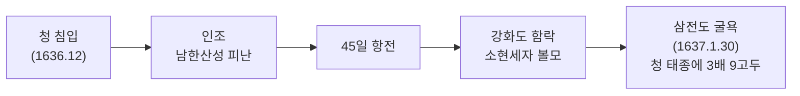
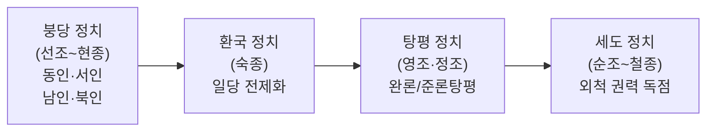

# 조선 후기 (1592~1863)

> 한국사능력검정시험 심화(고급) 대비 학습자료

---

## 1. 시대 개관

조선 후기는 임진왜란(1592)·병자호란(1636) 이후 사회·경제적 변동이 심화된 시기이다. 양란으로 인한 국가 재정 파탄과 사회 혼란을 극복하는 과정에서 수취 체제를 개편하고, 상품 경제가 발달하였다. 정치적으로는 붕당 정치 → 환국 → 탕평책 → 세도 정치 순으로 변화하였으며, 실학 사상과 서민 문화가 성장하였다.

**시대적 특징**- 양란 이후 복구 과정에서 사회·경제 구조 변화
- 수취 체제 개편: 영정법·대동법·균역법
- 상품 화폐 경제 발달, 신분제 동요
- 붕당 정치 → 환국 → 탕평 → 세도정치 변화
- 실학 사상 대두, 서민 문화 발달
- 천주교 전래, 동학 창시

---

## 2. 왕별 정책 (조선 후기)

### 🔴 광해군 (1608~1623, 제15대)

>**핵심 키워드**: 중립 외교, 대동법(경기), 동의보감, 인조반정

| 분야 | 정책                       | 내용                                            |
| ---- | -------------------------- | ----------------------------------------------- |
| 외교 | **중립 외교**| 명과 후금 사이에서 균형 외교 (강홍립 투항 묵인) |
| 경제 |**대동법 경기 시행(1608)**| 공납 개혁, 경기 지방에 최초 실시                |
| 문화 |**동의보감 완성(1613)**| 허준이 편찬한 의학 백과사전                     |
| 사업 | 전후 복구                  | 경복궁·창덕궁 등 궁궐 재건                      |
| 사건 |**인조반정(1623)**| 서인 세력이 광해군 폐위, 인조 옹립              |

### 🔴 인조 (1623~1649, 제16대)

>**핵심 키워드**: 친명배금, 이괄의 난, 정묘호란, 병자호란, 삼전도 굴욕

| 분야 | 사건                    | 내용                                  |
| ---- | ----------------------- | ------------------------------------- |
| 정치 | **이괄의 난(1624)**| 반정 공신 이괄의 반란, 인조 공주 피난 |
| 외교 |**친명배금 정책**| 서인의 반청(反淸) 노선                |
| 전쟁 |**정묘호란(1627)**| 후금 침입 → 형제 관계 맺고 화의       |
| 전쟁 |**병자호란(1636~1637)**| 청 침입 → 삼전도 굴욕, 군신 관계 수락 |
| 제도 | 어영청·총융청·수어청    | 군사 조직 정비 (5군영 시작)           |

### 효종 (1649~1659, 제17대)

| 분야 | 내용                                                             |
| ---- | ---------------------------------------------------------------- |
| 정치 |**북벌론** 추진 (송시열 중심), 군비 강화                         |
| 대외 |**나선정벌**– 청의 요청으로 조총 부대 두 차례 파병 (1654, 1658) |
| 경제 | 대동법 충청·전라도 확대 실시                                     |

### 현종 (1659~1674, 제18대)**예송 논쟁**: 효종 사후 자의대비(인조 계비)의 복상 기간을 둘러싼 서인·남인 대립

| 구분      | **1차 예송(1659)**|** 2차 예송(1674)**|
| --------- | -------------------------------------- | ------------------ |
| 계기      | 효종 사망                              | 효종비 사망        |
| 서인 주장 | 기년복(1년)                            | 대공복(9개월)      |
| 남인 주장 | 3년복                                  | 기년복(1년)        |
| 결과      | 서인 승리                              | 남인 승리          |
| 의의      | 붕당 간 의례 논쟁 = 정치 헤게모니 다툼 |

### 🔴 숙종 (1674~1720, 제19대)

>**핵심 키워드**: 환국 정치, 상평통보, 백두산 정계비, 대동법 완성

| 분야 | 내용                                                           |
| ---- | -------------------------------------------------------------- |
| 정치 | **경신환국(1680)**: 남인 → 서인 집권                           |
| 정치 | **기사환국(1689)**: 서인 → 남인 집권 (장희빈 왕비 책봉)        |
| 정치 | **갑술환국(1694)**: 남인 → 서인 집권 (장희빈 사사)             |
| 경제 | **상평통보 전국 유통**– 전국적 화폐 경제 기반 마련            |
| 영토 |**대동법 전국 완성(1708)**– 황해도까지 실시                   |
| 영토 |**백두산 정계비(1712)**– 조·청 국경 확정                      |
| 영토 |**안용복 활동**– 독도 수호, 일본에 울릉도·독도 조선 영토 확인 |

### ⭐🔴 영조 (1724~1776, 제21대)

>**핵심 키워드**: 탕평책(완론탕평), 균역법, 속대전, 탕평비

| 분야 | 정책                              | 내용                                      |
| ---- | --------------------------------- | ----------------------------------------- |
| 정치 | **완론탕평**| 노론·소론 균형 유지, 성균관에 탕평비 건립 |
| 경제 |**균역법(1750)**| 군포 2필 → 1필 감면, 결작·어염선세로 보충 |
| 법전 |**속대전 편찬**| 경국대전 이후 추가 법령 정리              |
| 민생 | 신문고 부활                       | 백성의 억울함 해소                        |
| 민생 | 청계천 준설                       | 홍수 방지                                 |
| 형벌 | 사형 집행 3심제                   | 신중한 사형 집행 제도화                   |
| 사건 |**이인좌의 난(1728)**| 소론 과격파 반란, 진압                    |
| 사건 |**사도세자 사건(1762, 임오화변)**| 영조가 사도세자를 뒤주에 가두어 사망      |

### ⭐🔴 정조 (1776~1800, 제22대)

>**핵심 키워드**: 준론탕평, 규장각, 장용영, 수원 화성, 신해통공, 대전통편

| 분야 | 정책                  | 내용                                       |
| ---- | --------------------- | ------------------------------------------ |
| 정치 | **준론탕평**| 인재 등용 중심의 적극적 탕평               |
| 기관 |**규장각 설치(1776)**| 왕실 도서관 겸 학술·정책 연구 기관         |
| 제도 |**초계문신제**| 37세 이하 젊은 관리 재교육, 정조 직접 강의 |
| 군사 |**장용영 설치**| 국왕 친위 부대                             |
| 건설 |**수원 화성 건설**| 정약용 설계, 거중기 활용, 계획 도시        |
| 경제 |**신해통공(1791)**| 시전 상인의 금난전권 폐지, 자유 상업 허용  |
| 법전 |**대전통편**| 경국대전·속대전 정리 통합                  |
| 출판 |**무예도보통지**| 병법서                                     |

### 순조 (1800~1834, 제23대)

-**세도정치 시작**: 안동 김씨 집권 (김조순)
- **신유박해(1801)**: 천주교 대규모 박해, 신유년에 발생
- **홍경래의 난(1811)**: 평안도 세력의 반란, 5개월간 지속

### 헌종·철종 (1834~1863)

- 세도정치 지속 (풍양 조씨 → 안동 김씨)
- **삼정의 문란**: 전정·군정·환곡 폐단 심화
- **임술농민봉기(1862)**: 진주(유계춘) 중심, 전국 확산

---

## 3. 병자호란 (1636~1637)

### 배경

- 후금이 **청(淸)** 으로 국호 변경(1636), 조선에 **군신 관계** 요구
- 인조 정부의 거부 → 청 태종 직접 침입

### 전개

### 결과

| 내용           | 세부 사항                           |
| -------------- | ----------------------------------- |
| 군신 관계 수락 | 조선이 청의 신하국 됨               |
| 볼모           | 소현세자·봉림대군(효종) 심양에 볼모 |
| 배상           | 다량의 금·은·포목·군마 등           |
| 반청 감정      | 북벌론(北伐論) 대두                 |

---

## 4. 정치 흐름 변화

---

## 5. ⭐ 수취 체제 개편 (3대 세제 개혁)

| 구분      |**영정법 **|** 대동법 **|** 균역법**|
| --------- | -------------------------- | ---------------------------------- | ------------------------ |
| 시행 연도 | 1635 (인조)                | 1608~1708                          | 1750 (영조)              |
| 대상      | 전세 (토지세)              | 공납 (특산물)                      | 군역 (군포)              |
| 내용      | 토지 1결당 4~6두 고정      | 토지 결수에 따라 쌀·포·전으로 납부 | 군포 2필 → 1필           |
| 배경      | 풍흉에 따른 세금 변동 문제 | 방납(防納) 폐단 심화               | 군포 부담 과중           |
| 효과      | 농민 부담 일부 경감        | 공인(貢人) 등장, 상업 발달         | 군역 부담 경감           |
| 보완      | –                          | –                                  | 결작·어염선세·선무군관포 |

> [!IMPORTANT]
>**대동법** 의 핵심 효과: 공납 → 쌀(미)·베(포)·돈(전)으로 대납하면서 **공인(貢人)** 이 등장, 상품 화폐 경제 발달의 촉매제가 되었다.

---

## 6. 경제 발달

### 농업

-**이앙법(모내기법) 보급**: 노동력 절약, 벼·보리 이모작 가능
- **상품 작물 재배**: 담배·면화·채소 등 상품성 높은 작물 재배

### 상업 (사상의 성장)

| 상인                | 거점 | 주요 활동            |
| ------------------- | ---- | -------------------- |
| **경강상인**| 한강 | 미곡·소금·어물 운반  |
|**송상(개성 상인)**| 개성 | 인삼 무역, 전국 상권 |
|**만상(의주 상인)**| 의주 | 대중국(청) 무역      |
|**내상(동래 상인)**| 동래 | 대일본 무역          |

-**장시(장날) 발달**: 5일장 전국 확산, 보부상이 장시 연결
- **상평통보** 전국 유통 (숙종) → 화폐 경제 발달

### 수공업

-**민영 수공업 발달**: 관영 수공업 약화, 자유 판매 목적 생산 확대
- **선대제 수공업**: 상인이 원료·자금 제공, 장인이 생산

---

## 7. ⭐ 실학 (實學)

### 실학의 배경

- 성리학의 현실 부적합성 인식
- 양란 이후 사회 모순 심화
- 청의 고증학 영향
- 서양 문물 전래

### 중농학파 (경세치용 학파)

| 학자       | 주요 저서                  | 토지 개혁론 | 핵심 주장                        |
| ---------- | -------------------------- | ----------- | -------------------------------- |
| **유형원 **| 반계수록                   |** 균전론**| 신분에 따라 토지 균등 지급       |
|**이익 **| 성호사설, 곽우록           |** 한전론**| 토지 최소 보유량 설정, 매매 제한 |
|**정약용 **| 목민심서·경세유표·흠흠신서 |** 여전론**| 마을 단위 공동 경작·분배         |

### 중상학파 (이용후생 학파, 북학파)

| 학자       | 주요 저서                | 핵심 주장                        |
| ---------- | ------------------------ | -------------------------------- |
|**유수원**| 우서                     | 상공업 진흥, 사농공상 직업 평등  |
|**홍대용**| 의산문답, 담헌서         | 지전설, 중국 중심 세계관 탈피    |
|**박지원**| 열하일기, 허생전, 양반전 | 청의 선진 문물 수용, 상공업 진흥 |
|**박제가**| 북학의                   | 청 문물 적극 수용, 소비 촉진론   |

### 국학 연구

| 분야 | 학자       | 저서                             |
| ---- | ---------- | -------------------------------- |
| 역사 |**안정복**| 동사강목 (기자조선~고려, 강목체) |
| 역사 |**한치윤**| 해동역사 (외국 자료 인용)        |
| 역사 |**이긍익**| 연려실기술 (조선 시대 기사체)    |
| 역사 |**유득공**| 발해고 (발해 역사 연구)          |
| 지리 |**이중환**| 택리지 (생활 지리서)             |
| 지리 |**김정호**| 대동여지도 (1861, 목판 지도)     |
| 언어 |**이의봉**| 고금석림                         |

---

## 8. 서민 문화

| 분야           | 내용                                                               |
| -------------- | ------------------------------------------------------------------ |
|**한글소설**| 홍길동전(허균), 춘향전, 심청전, 흥부전, 구운몽(김만중)             |
|**판소리**| 춘향가·심청가·흥보가·수궁가·적벽가 (신재효가 정리)                 |
|**탈춤**| 봉산탈춤, 하회별신굿탈놀이 등 – 양반 풍자                          |
|**민화**| 서민의 소망과 감정 표현                                            |
|**풍속화 **|** 김홍도 **: 서민 생활 (씨름·서당·무동),** 신윤복**: 여성·남녀 풍류 |
| **진경산수화 **|** 정선**: 인왕제색도, 금강전도 – 조선 실경 표현                    |
| **사설시조**| 형식 파괴, 서민 감정 표현                                          |

---

## 9. 종교

### 천주교 (서학)

| 시기               | 내용                                              |
| ------------------ | ------------------------------------------------- |
| 17세기             | 서학(천주교)으로 중국 통해 전래                   |
| 1784               | 이승훈, 북경에서 영세 → 국내 최초 세례            |
|**신유박해(1801)**| 순조, 황사영 백서 사건, 신부·신도 대규모 처형     |
|**기해박해(1839)**| 프랑스 신부 3명 처형                              |
|**병오박해(1846)**| 김대건 신부 순교                                  |
|**병인박해(1866)**| 프랑스 신부 9명 포함 수천 명 처형 → 병인양요 원인 |

### 동학

-**창시**: 최제우(1860), 경주 출신
- **핵심 사상**: 인내천(人乃天) – 사람이 곧 하늘
- **경전**: 동경대전, 용담유사
- **특징**: 반봉건·반외세, 유·불·도 융합
- **전개**: 교조 신원 운동(1892) → 동학농민운동(1894)

---

## 10. ⭐ 흥선대원군 집권기 (1863~1873)

> 고종이 어린 나이에 즉위하자 생부 흥선대원군(이하응)이 섭정

### 국내 정책

| 분야      | 정책            | 내용                                               |
| --------- | --------------- | -------------------------------------------------- |
| 왕권 강화 | **경복궁 중건**| 원납전(기부금)·당백전(고액 화폐) 발행 → 물가 상승  |
| 왕권 강화 |**서원 철폐 **| 전국 600여 개 서원 중** 47개만 존치**, 나머지 철폐 |
| 민생      | **사창제** 실시 | 환곡의 폐단 개선, 지역 단위 곡식 저장·대출         |
| 민생      | 삼정 개혁       | 전정·군정·환곡 개혁 시도                           |
| 인재      | 비변사 폐지     | 의정부·6조 기능 회복, 비변사 약화                  |

### 대외 정책 (척화(斥和) 정책)

| 사건                   | 연도 | 내용                                                                                    |
| ---------------------- | ---- | --------------------------------------------------------------------------------------- |
|**오페르트 도굴 사건**| 1868 | 독일 상인 오페르트가 흥선대원군 부친 묘 도굴 시도 → 통상 요구                           |
|**병인양요**| 1866 | 프랑스가 병인박해를 빌미로 강화도 침략 → 양헌수가 정족산성에서 격퇴, 외규장각 문서 약탈 |
|**신미양요**| 1871 | 미국이 제너럴셔먼호 사건 빌미로 강화도 침략 → 어재연이 광성보에서 항전                  |
|**척화비 건립**| 1871 | "洋夷侵犯 非戰則和 主和賣國" – 전국 각지에 건립                                         |

> [!NOTE]
> 흥선대원군은 1873년 고종의 친정 선언으로 실각하였다. 이후 명성황후(민씨 가문)가 정치적 실권을 장악하였다.

---

## 11. ⭐ 빈출·핵심 개념 정리

> [!TIP]
>**자주 출제되는 비교 포인트 **- ⭐** 대동법 시행 순서**: 경기(1608, 광해군) → 강원·충청·전라 → 경상·황해(1708, 숙종) – 100년에 걸쳐 전국 확대
- ⭐ **영조 균역법(1750)**: 군포 2필 → 1필, 결작·어염선세·선무군관포로 재정 보충
- ⭐ **탕평책 비교**: 영조(완론탕평) vs 정조(준론탕평)
- ⭐ **환국 순서**: 경신(1680) → 기사(1689) → 갑술(1694)
- ⭐ **예송 논쟁**: 1차(1659, 서인 승리) → 2차(1674, 남인 승리)
- 🔴 **병자호란 결과**: 삼전도 굴욕(1637), 소현세자·봉림대군 볼모
- 🔴 **실학자 분류**: 중농(유형원·이익·정약용) vs 중상/북학(홍대용·박지원·박제가)
- 🔴 **서원 철폐**: 흥선대원군, 600여 개 중 47개만 남김
- 🔴 **병인양요(1866, 프랑스) vs 신미양요(1871, 미국)** 구분

---

## 12. 연표

| 연도       | 사건                          |
| ---------- | ----------------------------- |
| 1608       | 광해군 즉위, 대동법 경기 시행 |
| 1613       | 동의보감 완성 (허준)          |
| 1623       | 인조반정, 인조 즉위           |
| 1624       | 이괄의 난                     |
| 1627       | 정묘호란                      |
| 1635       | 영정법 실시                   |
| 1636~1637  | 병자호란, 삼전도 굴욕         |
| 1645       | 소현세자 귀국 후 급사         |
| 1654, 1658 | 나선정벌 (효종)               |
| 1659       | 1차 예송 논쟁                 |
| 1674       | 2차 예송 논쟁                 |
| 1680       | 경신환국                      |
| 1689       | 기사환국                      |
| 1694       | 갑술환국                      |
| 1708       | 대동법 전국 완성              |
| 1712       | 백두산 정계비                 |
| 1728       | 이인좌의 난                   |
| 1750       | 균역법 (영조)                 |
| 1762       | 사도세자 사건 (임오화변)      |
| 1776       | 정조 즉위, 규장각 설치        |
| 1791       | 신해통공                      |
| 1800       | 순조 즉위, 세도정치 시작      |
| 1801       | 신유박해                      |
| 1811       | 홍경래의 난                   |
| 1860       | 동학 창시 (최제우)            |
| 1862       | 임술농민봉기                  |
| 1863       | 고종 즉위, 흥선대원군 집권    |
| 1866       | 병인박해, 병인양요            |
| 1868       | 오페르트 도굴 사건            |
| 1871       | 신미양요, 척화비 건립         |
| 1873       | 흥선대원군 하야               |

---

## 참고 출처

- 한국민족문화대백과사전: https://encykorea.aks.ac.kr
- 국사편찬위원회 한국사데이터베이스: https://db.history.go.kr
- 한국사능력검정시험 공식 홈페이지: https://www.historyexam.go.kr
- 국립중앙박물관: https://www.museum.go.kr
- 문화재청 국가유산포털: https://www.heritage.go.kr
