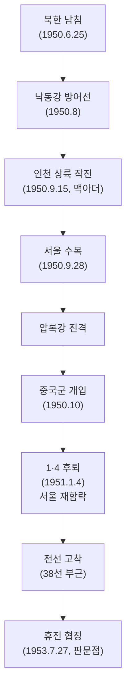
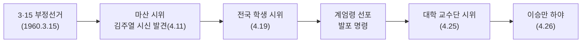
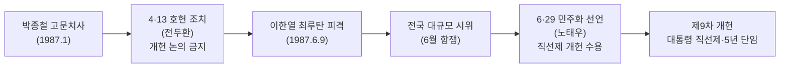

# 현대사 – 광복 이후 ~ 현재 (1945~)

> 한국사능력검정시험 심화(고급) 대비 학습자료

---

## 1. 시대 개관

1945년 8월 15일 광복 이후 미·소 분할 점령, 신탁통치 논쟁, 좌우 갈등을 거쳐 남한(1948.8.15)과 북한(1948.9.9) 각각 정부가 수립되었다. 6·25 전쟁(1950~1953)으로 분단이 고착화되었고, 이후 이승만·박정희·전두환 등 권위주의 정권과 민주화 운동의 대립이 반복되었다. 1987년 6월 민주 항쟁으로 직선제 개헌이 이루어졌으며, 이후 남북 관계 개선과 민주주의 심화가 이루어졌다.

**시대적 특징**- 미군정 → 남북 분단 정부 수립 → 6·25 전쟁
- 이승만 독재 → 4·19 혁명 → 5·16 군사정변 → 유신 → 5·18 광주 → 6월 항쟁
- 민주화 이후 햇볕정책 등 남북 관계 변화

---

## 2. 광복과 미군정 (1945~1948)

### 광복 직후 상황

| 사건                   | 내용                                                    |
| ---------------------- | ------------------------------------------------------- |
|**8·15 광복(1945)**| 일제 패망, 35년 식민지 종식                             |
|**38선 분할**| 미·소 군사 편의상 38선 기준으로 남(미)·북(소) 분할 점령 |
|**조선건국준비위원회**| 여운형 주도, 광복 직후 치안·행정 담당                   |
|**미군정 실시**| 1945.9, 남한에 군정 실시 (하지 중장)                    |

### 모스크바 3상 회의 (1945.12)

-**참가국**: 미·영·소 3국 외상
- **결정 내용 **: 임시 민주 정부 수립,** 최장 5년간 신탁 통치**실시, 미소공동위원회 설치
-**반응**: 우익(반탁) vs 좌익(처음 반탁 → 이후 찬탁)
- 좌우 이념 갈등 격화

### 미소공동위원회 & 좌우합작운동

| 사건                         | 내용                                                 |
| ---------------------------- | ---------------------------------------------------- |
| **미소공동위원회 1차(1946)**| 임시 정부 수립 협의 → 결렬                           |
|**좌우합작운동(1946~1947)**| 여운형(좌)·김규식(우) 중심 통합 시도, 좌우합작 7원칙 |
|**미소공동위원회 2차(1947)**| 최종 결렬                                            |
|**남북 협상(1948)**| 김구·김규식 평양 방문, 단독 선거 반대                |

### 단독 정부 수립 과정

-**유엔 한국임시위원단** 구성 → 소련 북한 입북 거부
-**5·10 총선거(1948)**: 남한 단독 선거 실시, 제헌 국회 구성
- **제헌헌법 공포(1948.7.17)**-** 대한민국 정부 수립(1948.8.15)**: 이승만 초대 대통령
- **조선민주주의인민공화국 수립(1948.9.9)**: 김일성

---

## 3. 대한민국 정부 수립 초기

### 반민족행위처벌법 (반민특위)

- 1948.9 제헌 국회에서 제정
- **반민족행위특별조사위원회(반민특위)** 구성
- 친일 세력 청산 시도 → 이승만 정부의 방해, 6·25 전쟁으로 사실상 실패

### 농지개혁 (1949~1950)

-**농지개혁법(1949)**: 유상 매수·유상 분배 원칙
- 지주 토지를 국가가 매입 → 소작농에게 유상 분배 (3정보 한도)
- 지주제 해체, 자작농 창출 → 한국 자본주의 발전 기반
- 북한의 무상 몰수·무상 분배와 차이

---

## 4. 6·25 전쟁 (1950~1953)

### 전개 과정

### 주요 사건

| 사건                | 내용                                                     |
| ------------------- | -------------------------------------------------------- |
| 북한 남침           | 1950.6.25 새벽, 소련제 탱크 앞세워 기습 침략             |
| **인천 상륙 작전**| 1950.9.15, 맥아더 유엔군 총사령관 지휘                   |
| 서울 수복           | 1950.9.28                                                |
| 중국군(중공군) 개입 | 1950.10 → 전세 역전                                      |
|**1·4 후퇴**| 1951.1.4, 서울 다시 함락                                 |
| 전선 고착           | 38선 부근에서 교착 상태                                  |
|**휴전 협정**| 1953.7.27, 판문점, 유엔군·북한·중국 3자 서명 (남한 불참) |

### 전쟁의 결과

| 분야             | 내용                                      |
| ---------------- | ----------------------------------------- |
| 인명 피해        | 남북한 합쳐 수백만 명 사망·부상           |
| 이산가족         | 수백만 가족 이산                          |
| 분단 고착        | 38선 → 휴전선(155마일) 고착               |
| 국제 관계        | 미국의 한국 안보 개입 강화, 한미동맹 기초 |
| 한미상호방위조약 | 1953.10 체결                              |

---

## 5. 이승만 정부 (1948~1960)

### 독재 강화 과정

| 사건                      | 연도                                                              | 내용 |
| ------------------------- | ----------------------------------------------------------------- | ---- |
|**발췌 개헌(1952)**| 전쟁 중 임시 수도 부산에서 기립 투표로 강행, 대통령 직선제 개헌   |
|**사사오입 개헌(1954)**| 초대 대통령에 한해 중임 제한 철폐, 반올림(사사오입)으로 가결 처리 |
|**진보당 사건(1958)**| 조봉암 간첩 혐의로 처형                                           |
|**국가보안법 개정(1958)**| 언론·야당 탄압                                                    |
|**3·15 부정선거(1960)**| 이기붕 부통령 당선을 위한 대규모 부정 선거                        |

### 4·19 혁명 (1960)

-**결과**: 이승만 하야, 하와이 망명
- **허정 과도 정부** 구성 → 내각제 개헌 → 제2공화국

---

## 6. 장면 내각 (1960~1961, 제2공화국)

- 대통령: 윤보선 / 국무총리: 장면
- 의원 내각제 (내각 중심 정치)
- 다양한 사회 운동·시위 분출 (남북 협상론 등)
- 경제 개발 5개년 계획 준비 → 5·16으로 중단

---

## 7. 5·16 군사정변 (1961)

- 1961.5.16,**박정희** 소장 주도 군사 쿠데타
- 국가재건최고회의 설치, 헌정 중단
- 중앙정보부(KCIA) 창설 (김종필)
- 1963년 민정 이양 → 제3공화국 출범

---

## 8. 박정희 정부 (1963~1979)

### 주요 정책

| 분야 | 사건/정책                   | 내용                                                            |
| ---- | --------------------------- | --------------------------------------------------------------- |
| 외교 |**한일협정(1965)**| 일본과 국교 정상화, 청구권 자금 수령 → 굴욕 외교 논란, 6·3 항쟁 |
| 외교 |**베트남 파병(1965~1973)**| 브라운 각서 체결, 외화 획득, 민간인 학살 논란                   |
| 경제 |**경제개발 5개년 계획**| 1·2차(1962~1971) 중화학공업 → 3·4차(1972~1981) 중화학공업       |
| 경제 |**경부고속도로 개통(1970)**| 서울~부산 428km                                                 |
| 경제 |**새마을 운동(1970)**| 농촌 근대화 운동                                                |
| 정치 |**3선 개헌(1969)**| 대통령 3회 연임 허용                                            |

### ⭐ 유신 체제 (1972~1979)

| 항목                   | 내용                                                              |
| ---------------------- | ----------------------------------------------------------------- |
|**10월 유신(1972.10)** | 비상 계엄 선포, 국회 해산, 유신 헌법 확정                         |
| 핵심 내용              | 대통령 간선제(**통일주체국민회의** 선출), 임기 6년·중임 제한 없음 |
| 핵심 내용              | 대통령이 국회의원 1/3 추천 (유신정우회),**긴급조치권**|
| 저항 운동              | 3·1 민주구국선언(1976), 유신 반대 운동                            |
| 종료                   |**10·26 사태(1979.10.26)**– 중앙정보부장 김재규가 박정희 암살    |

---

## 9. 전두환 정부 (1980~1988)

### 12·12 사태 (1979.12)

- 전두환·노태우 등 신군부 세력이 정승화 계엄사령관 체포 → 군권 장악

### ⭐ 5·18 민주화 운동 (1980.5.18~27)

| 항목 | 내용                                                 |
| ---- | ---------------------------------------------------- |
| 배경 | 신군부의 비상 계엄 전국 확대, 민주화 요구 탄압       |
| 전개 | 광주 학생·시민 시위 → 공수부대 진압 → 시민군 결성    |
| 결과 | 계엄군 진압, 수백 명 사망 (광주)                     |
| 의의 | 한국 민주주의의 역사적 토대, 세계기록유산 등재(2011) |

### 전두환 정권 특징

| 항목 | 내용                                              |
| ---- | ------------------------------------------------- |
| 헌법 | 제8차 개헌 (간선제, 7년 단임)                     |
| 정치 | 삼청교육대, 언론 통폐합, 정치 활동 규제           |
| 경제 | 3저 호황(저금리·저유가·저달러), 올림픽 유치(1981) |
| 사건 | KAL기 격추(1983), 아웅산 테러(1983, 버마)         |

---

## 10. ⭐ 6월 민주 항쟁 (1987)

-**6·29 민주화 선언(1987.6.29)**: 노태우(민정당 대통령 후보) 발표
- **직선제 개헌 (현행 헌법)**: 대통령 직선제, 5년 단임
- 1987.12 대선: 노태우 당선 (야권 분열 – 김영삼·김대중)

---

## 11. 노태우 정부 이후 역대 정부

### 노태우 정부 (1988~1993, 제6공화국)

| 분야 | 내용                                                 |
| ---- | ---------------------------------------------------- |
| 외교 | **북방 외교**– 소련(1990)·중국(1992)과 수교         |
| 남북 |**남북 유엔 동시 가입 (1991. 9)**|
| 남북 |**한반도 비핵화 공동 선언 (1991. 12)**|
| 남북 |**남북기본합의서 (1991. 12)**– 상호 불가침, 교류 협력 |
| 정치 | 여소야대 국회, 3당 합당(1990)                        |

### 김영삼 정부 (1993~1998, 문민정부)

| 분야 | 내용                                                 |
| ---- | ---------------------------------------------------- |
| 개혁 |**금융실명제 실시 (1993. 8)**– 긴급 명령으로 시행   |
| 개혁 |**하나회 숙청**– 군내 사조직 해체                   |
| 역사 | 조선총독부 건물 철거(1995), 전두환·노태우 구속(1996) |
| 경제 |**IMF 외환위기 (1997. 11)**– 구제금융 신청            |

### 김대중 정부 (1998~2003, 국민의 정부)

| 분야 | 내용                                          |
| ---- | --------------------------------------------- |
| 경제 | IMF 조기 졸업, 구조 조정                      |
| 남북 |**햇볕정책**(포용 정책)                      |
| 남북 |**제1차 남북정상회담 (2000. 6)**– 평양, 김정일 |
| 남북 |**6·15 남북공동선언 (2000)**|
| 남북 | 금강산 관광, 개성 공단 추진                   |
| 수상 |**노벨 평화상 수상 (2000)**|

### 노무현 정부 (2003~2008, 참여정부)

| 분야 | 내용                                                |
| ---- | --------------------------------------------------- |
| 남북 |**제2차 남북정상회담 (2007. 10)**– 평양, 김정일      |
| 남북 |**10·4 선언 (남북관계 발전과 평화번영을 위한 선언)**|
| 정치 | 탄핵 소추(2004) → 헌법재판소 기각                   |
| 경제 | 한미 FTA 협상                                       |

### 이명박 정부 (2008~2013)

| 분야 | 내용                                               |
| ---- | -------------------------------------------------- |
| 경제 | 4대강 사업, G20 서울 정상회의(2010)                |
| 남북 |**금강산 관광 중단 (2008)**– 관광객 피격 사망 사건 |
| 남북 | 천안함 피격(2010), 연평도 포격(2010) → 관계 경색   |

### 박근혜 정부 (2013~2017)

| 분야 | 내용                                        |
| ---- | ------------------------------------------- |
| 남북 |**개성 공단 폐쇄 (2016)**– 북한 핵실험 대응 |
| 사건 |**세월호 참사 (2014. 4)**|
| 사건 |**국정농단 사태 (2016~2017)**– 최순실 사건  |
| 사건 |**탄핵 인용 (2017. 3. 10)**– 헌법재판소       |

### 문재인 정부 (2017~2022)

| 분야 | 내용                                                    |
| ---- | ------------------------------------------------------- |
| 남북 |**제1·2·3차 남북정상회담 (2018)**|
| 남북 |**판문점 선언 (2018. 4)**– 완전한 비핵화, 종전 선언 추진 |
| 남북 | 평양공동선언 (2018. 9)                                    |
| 경제 | 소득주도 성장                                           |

---

## 12. ⭐ 남북 관계 주요 합의 비교

| 합의                  | 연도 | 정부          | 핵심 내용                                       |
| --------------------- | ---- | ------------- | ----------------------------------------------- |
|**7·4 남북공동성명**| 1972 | 박정희/김일성 | 자주·평화·민족 대단결 3원칙, 분단 후 최초 합의  |
|**남북기본합의서**| 1991 | 노태우/김일성 | 특수 관계 인정, 불가침·교류 합의                |
|**6·15 남북공동선언**| 2000 | 김대중/김정일 | 최초 남북정상회담, 통일 방안 공통성 인정        |
|**10·4 선언**| 2007 | 노무현/김정일 | 6·15 계승, 군사적 긴장 완화 합의                |
|**판문점 선언**| 2018 | 문재인/김정은 | 완전한 비핵화, 종전 선언, 남북 공동 연락 사무소 |

> [!NOTE]
>**7·4 남북공동성명 (1972)**: 이후 남북 모두 이를 권력 강화(유신 체제, 북한 사회주의 헌법)에 활용한 한계가 있었다.

---

## 13. ⭐ 대한민국 헌법 개정 연표

| 차수         | 연도     | 주요 내용                                     | 배경              |
| ------------ | -------- | --------------------------------------------- | ----------------- |
| 제헌 헌법    | 1948     | 대통령 간선제(국회), 4년 임기                 | 정부 수립         |
| 1차 개헌     | 1952     | 대통령 **직선제**| 발췌 개헌, 이승만 |
| 2차 개헌     | 1954     | 초대 대통령 중임 제한 철폐                    | 사사오입 개헌     |
| 3차 개헌     | 1960     | 의원 내각제                                   | 4·19 혁명 이후    |
| 5차 개헌     | 1962     | 대통령 직선제                                 | 5·16 이후 군정    |
| 7차 개헌     | 1972     | 대통령 **간선제**(통일주체국민회의), 임기 6년 | 유신              |
| 8차 개헌     | 1980     | 대통령 간선제(선거인단), 임기 7년 단임        | 전두환            |
| **9차 개헌 **|** 1987 **| 대통령** 직선제**, 5년 단임                   | 6월 항쟁          |

---

## 14. ⭐ 빈출·핵심 개념 정리

> [!TIP]
> **자주 출제되는 비교 포인트 **- ⭐** 모스크바 3상 회의 (1945)**: 신탁 통치, 미소공동위원회
- ⭐ **발췌 개헌 (1952) vs 사사오입 개헌 (1954)**– 이승만 독재 강화 과정
- ⭐**4·19 혁명 (1960)**: 3·15 부정선거 → 학생 주도 → 이승만 하야
- ⭐ **인천 상륙 작전 (1950. 9. 15, 맥아더)**: 6·25 전쟁 전세 역전 계기
- ⭐ **유신 체제**: 통일주체국민회의(대통령 간선제), 긴급조치권
- ⭐ **5·18 민주화 운동 (1980)**: 광주, 신군부 계엄 확대 → 시민 항쟁
- ⭐ **6월 민주 항쟁 (1987)**: 박종철·이한열 → 6·29 선언 → 직선제 개헌
- 🔴 **남북정상회담**: 김대중 (2000, 평양) → 노무현 (2007, 평양) → 문재인 (2018, 판문점/평양)
- 🔴 **6·15 공동선언 (2000)**: 햇볕정책, 최초 남북정상회담
- 🔴 **7·4 남북공동성명 (1972)**: 자주·평화·민족 대단결, 분단 후 최초 남북 합의

---

## 15. 연표

| 연도       | 사건                                  |
| ---------- | ------------------------------------- |
| 1945.8.15  | 광복                                  |
| 1945.12    | 모스크바 3상 회의 (신탁 통치 결정)    |
| 1946       | 미소공동위원회 1차, 좌우합작운동      |
| 1947       | 미소공동위원회 2차 결렬               |
| 1948.5.10  | 5·10 총선거                           |
| 1948.7.17  | 제헌헌법 공포                         |
| 1948.8.15  | 대한민국 정부 수립                    |
| 1949       | 농지개혁법 제정, 반민특위 활동        |
| 1950.6.25  | 6·25 전쟁 발발                        |
| 1950.9.15  | 인천 상륙 작전                        |
| 1951.1.4   | 1·4 후퇴                              |
| 1953.7.27  | 휴전 협정 체결                        |
| 1952       | 발췌 개헌 (이승만)                    |
| 1954       | 사사오입 개헌 (이승만)                |
| 1960.3.15  | 3·15 부정선거                         |
| 1960.4.19  | 4·19 혁명                             |
| 1961.5.16  | 5·16 군사정변 (박정희)                |
| 1963       | 박정희 제3공화국                      |
| 1965       | 한일협정, 베트남 파병                 |
| 1969       | 3선 개헌                              |
| 1972.7.4   | 7·4 남북공동성명                      |
| 1972.10    | 유신 헌법                             |
| 1979.10.26 | 10·26 사태 (박정희 암살)              |
| 1979.12.12 | 12·12 사태 (신군부)                   |
| 1980.5.18  | 5·18 민주화 운동 (광주)               |
| 1980       | 전두환 정부 출범                      |
| 1987.1     | 박종철 고문치사                       |
| 1987.4.13  | 4·13 호헌 조치                        |
| 1987.6     | 6월 민주 항쟁                         |
| 1987.6.29  | 6·29 민주화 선언                      |
| 1987.10    | 제9차 개헌 (직선제)                   |
| 1988       | 노태우 정부, 서울 올림픽              |
| 1991.9     | 남북 유엔 동시 가입                   |
| 1991.12    | 남북기본합의서, 비핵화 공동 선언      |
| 1993       | 김영삼 정부, 금융실명제               |
| 1997.11    | IMF 외환위기                          |
| 1998       | 김대중 정부                           |
| 2000.6     | **제1차 남북정상회담**, 6·15 공동선언 |
| 2000.12    | 노벨 평화상 (김대중)                  |
| 2003       | 노무현 정부                           |
| 2007.10    | **제2차 남북정상회담**, 10·4 선언     |
| 2008       | 이명박 정부, 금강산 관광 중단         |
| 2010       | 천안함 피격, 연평도 포격              |
| 2013       | 박근혜 정부                           |
| 2016.10    | 국정농단 사태                         |
| 2017.3.10  | 박근혜 탄핵                           |
| 2017       | 문재인 정부                           |
| 2018.4     | 판문점 선언                           |
| 2018.9     | 평양공동선언                          |

---

## 참고 출처

- 한국민족문화대백과사전: https://encykorea.aks.ac.kr
- 국사편찬위원회 한국사데이터베이스: https://db.history.go.kr
- 한국사능력검정시험 공식 홈페이지: https://www.historyexam.go.kr
- 민주화운동기념사업회: https://www.kdemo.or.kr
- 국립중앙박물관: https://www.museum.go.kr
- 통일부: https://www.unikorea.go.kr
