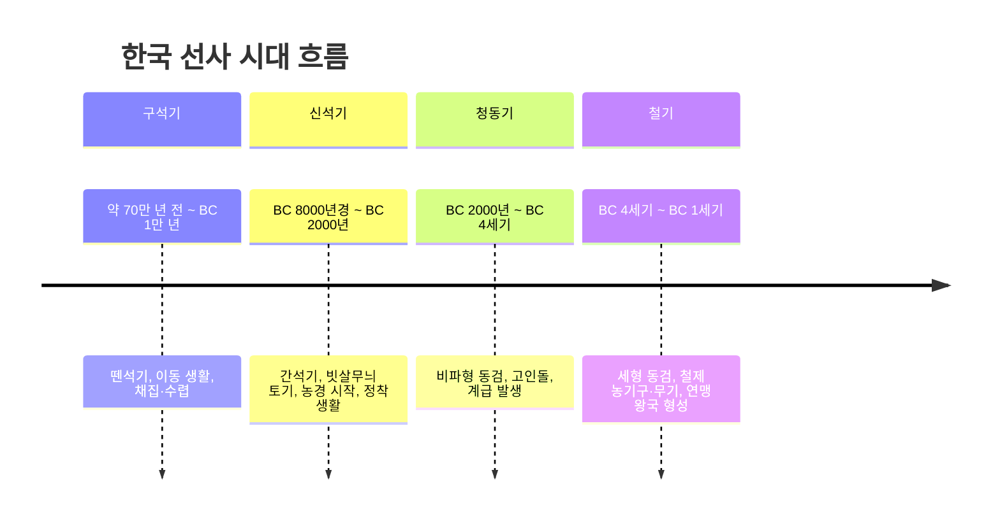

# 🏺 선사 시대 (구석기 ~ 철기) — 한국사능력검정 고급 대비

> [!IMPORTANT]
> 이 자료는 한국사능력검정시험 **고급(1·2급)** 대비용으로 작성되었습니다.
> ⭐ 빈출 개념 / 🔴 핵심 개념을 중심으로 학습하세요.

---

## 1. 시대 개관 — 선사 시대 전체 흐름

선사 시대(先史時代)란 문자 기록이 없는 시대로, 유물·유적을 통해 당시 생활상을 복원한다.



> [!NOTE]
> 구석기→신석기→청동기→철기의 시대 구분은 도구(석기→금속)와 사회 변화(평등→계급)를 기준으로 합니다.

---

## 2. 구석기 시대 🔴

### 2-1. 시기 및 특징

| 항목 | 내용 |
|------|------|
|**시기**| 약 70만 년 전 ~ BC 1만 년경 |
|**인류**| 호모 에렉투스 → 호모 사피엔스 단계 |
|**도구 **|** 뗀석기(타제석기)**: 찍개, 주먹도끼, 긁개, 밀개, 슴베찌르개 |
| **생활**| 이동 생활 (동굴, 바위 그늘, 강가의 막집) |
|**경제**| 채집·수렵·어로 |
|**사회 **| 무리 사회(무리를 지어 이동),** 평등 사회**|

### 2-2. ⭐ 대표 도구

-**찍개**: 가장 원시적인 도구, 가장 이른 시기
- **주먹도끼**: 다목적 도구, 연천 전곡리 출토 → 아슐리안 문화권 증거
- **긁개·밀개**: 가죽 가공, 청소용
- **슴베찌르개**: 구석기 후기, 창에 끼워 사용 → 간접 타격 방식

> [!TIP]
> **주먹도끼** 는 세계적으로 중요한 발견입니다. 연천 전곡리에서 동아시아 최초의 아슐리안형 주먹도끼가 발견되어, 기존의 "동아시아에는 주먹도끼 없다"는 모비우스 학설을 뒤집었습니다.

### 2-3. ⭐ 대표 유적

| 유적 | 위치 | 특징 |
|------|------|------|
| **연천 전곡리 **| 경기 연천 | 동아시아 최초 아슐리안형** 주먹도끼**발견 |
|**공주 석장리**| 충남 공주 | 남한 최초 구석기 발굴 유적 |
|**청원 두루봉 동굴 **| 충북 청주 |** 흥수아이**(어린아이 뼈 화석) 발견 |
|**단양 금굴**| 충북 단양 | 한반도 최초 인류 거주 흔적(약 70만 년 전) |
|**평양 상원 검은모루 동굴**| 북한 | 구석기 시대 대표 유적 |

### 2-4. 생활상
-**주거**: 동굴, 바위 그늘, 강가의 막집 (임시 거처)
- **불 사용**: 추위 극복, 요리, 맹수 방어
- **예술 활동**: 조각품·뼈 장신구 제작 → 정신 문화의 시작
- **매장 풍습**: 죽은 자를 매장 → 내세 관념의 존재

---

## 3. 신석기 시대 🔴

### 3-1. 시기 및 특징

| 항목 | 내용 |
|------|------|
| **시기**| BC 8000년경 ~ BC 2000년경 |
|**도구 **|** 간석기(마제석기)**: 돌보습, 돌괭이, 갈돌, 갈판 |
| **토기 **|** 빗살무늬 토기**(가장 대표적), 이른 민무늬 토기, 덧무늬 토기 |
|**생활 **| 정착 생활 시작 (강가·해안가** 움집**) |
| **경제 **| 농경·목축 시작 (** 신석기 혁명**) + 채집·수렵·어로 |
| **사회 **| 씨족 사회,** 평등 사회**, 모계 중심 |

### 3-2. 신석기 혁명의 의미
농경·목축의 시작으로 식량 생산이 가능해졌고, 이로 인해:
1. **정착 생활** 가능 → 움집 건설
2.**잉여 식량** 발생 → 사유 재산 개념의 시초
3.**분업** 시작 → 사회 복잡화의 출발

### 3-3. ⭐ 주요 유물

| 유물 | 특징 |
|------|------|
|**빗살무늬 토기**| 바닥이 뾰족한 형태, 강가·해안가에 세워 사용, 식량 저장용 |
|**가락바퀴**| 실을 뽑는 도구 → 직물 제작, 의복 생산 |
|**뼈바늘**| 가죽이나 직물 봉제 → 정교한 수공업의 증거 |
|**갈돌·갈판**| 곡물 빻는 도구 → 농경 시작의 증거 |

### 3-4. ⭐ 대표 유적

| 유적 | 위치 | 특징 |
|------|------|------|
|**서울 암사동**| 서울 강동 | 한반도 최대 신석기 집단 주거 유적 |
|**부산 동삼동**| 부산 영도 | 조개더미(패총), 일본 죠몬 토기와 함께 출토 → 대외 교류 증거 |
|**봉산 지탑리 **| 황해도 봉산 | 탄화된 조·기장 발견 →** 농경의 시작**증거 |
|**양양 오산리**| 강원 양양 | 이른 민무늬 토기, 덧무늬 토기 출토 |
|**제주 고산리**| 제주 | 한반도 최고(最古) 신석기 유적(BC 8000년) |

### 3-5. 신석기 사회와 신앙 **사회 구조**- 씨족 공동체: 혈연을 중심으로 구성된 최소 사회 단위
- 평등 사회: 지도자는 있으나 강제적 권력 없음
- 모계 중심 사회: 어머니 중심으로 계보 이어짐 **원시 신앙**| 신앙 | 내용 |
|------|------|
|**애니미즘**| 자연물(해, 달, 강, 바위 등)에 영혼이 깃들어 있다고 믿음 |
|**샤머니즘**| 무당(샤먼)이 신과 인간을 연결한다고 믿음 |
|**토테미즘**| 특정 동·식물을 부족의 상징(수호신)으로 숭배 |
|**영혼 불멸**| 사후 세계 관념 → 매장 풍습 |

---

## 4. 청동기 시대 🔴

### 4-1. 시기 및 특징

| 항목 | 내용 |
|------|------|
|**시기**| BC 2000년경 ~ BC 4세기 |
|**청동 도구 **|** 비파형 동검**, 거친무늬 거울(다뉴조문경), 청동 방울 |
| **석기 도구 **|** 반달 돌칼**(곡물 수확용), 바퀴날 도끼, 홈자귀 |
|**토기 **|** 민무늬 토기**(대표), 미송리식 토기, 붉은간토기 |
|**생활**| 정착 생활, 농경 발달(벼농사) |
|**사회 **|** 계급 발생**, 군장(족장) 등장, 사유 재산 제도 |

### 4-2. ⭐ 계급 발생의 증거

> 청동기는 지배층의 **무기·제사 도구** 로 사용, 일반 농민은 여전히 석기 사용
> → 지배층과 피지배층의 분화

**고인돌**: 지배층의 무덤
- 거대한 돌을 이동시키기 위해 수많은 노동력 필요
- 군장이 주민을 동원할 수 있는 권력 보유 증거
- **종류**: 탁자식(북방식), 바둑판식(남방식), 개석식

> [!IMPORTANT]
> **유네스코 세계유산**: 고창·화순·강화 고인돌 유적 (2000년 등재)
> 전 세계 고인돌의 약 40%가 한반도에 분포!

### 4-3. ⭐ 대표 유물 비교

| 유물 | 시대 | 특징 |
|------|------|------|
| **비파형 동검**| 청동기 | 검신이 비파 모양, 고조선 세력 범위 증거 |
|**거친무늬 거울**| 청동기 | 청동 거울, 제사·장식용 |
|**반달 돌칼**| 청동기 | 벼 이삭 수확 도구, 농경 사회 증거 |
|**민무늬 토기**| 청동기 | 무늬 없는 토기, 각종 형태 |

### 4-4. 대표 유적

| 유적 | 위치 | 특징 |
|------|------|------|
|**부여 송국리**| 충남 부여 | 송국리형 주거지(원형, 타원형 구덩이), 벼농사 증거 |
|**강화 고인돌**| 인천 강화 | 탁자식 고인돌(북방식) |
|**고창 고인돌**| 전북 고창 | 447기의 고인돌 군집 |
|**화순 고인돌**| 전남 화순 | 채석 과정 관찰 가능 |

---

## 5. 철기 시대 🔴

### 5-1. 시기 및 특징

| 항목 | 내용 |
|------|------|
|**시기**| BC 4세기 ~ BC 1세기 |
|**철기 도구 **|** 철제 농기구 **(쇠스랑, 쇠낫, 쇠도끼),** 철제 무기**|
|**청동기 **|** 세형 동검(한국식 동검)**, 잔무늬 거울(다뉴세문경), 거푸집 |
| **토기 **|** 검은간토기**(흑도장경호), 덧띠 토기 |
| **경제**| 철제 농기구로 농업 생산력 급증, 중국과 활발한 교역 |
|**사회**| 연맹 왕국 형성 (고조선, 부여, 고구려 등) |

### 5-2. ⭐ 중국 화폐 출토 → 교역 증거

| 화폐 | 국가·시기 | 의미 |
|------|-----------|------|
|**명도전**| 연나라(燕) | 철기 시대 초기, 고조선이 연과 교역 |
|**반량전**| 진나라(秦) | BC 3세기 진나라와 교역 |
|**오수전**| 한나라(漢) | BC 2세기 이후 한나라와 교역 |

> [!NOTE]
> 창원 다호리 유적에서 **붓(筆)** 이 발견 → 한반도에서 문자 사용 시작의 증거

### 5-3. 비파형 동검 vs 세형 동검 ⭐

| 구분 | 비파형 동검 | 세형 동검 |
|------|------------|----------|
| **시대**| 청동기 | 철기 |
|**형태**| 검신 넓음(비파 모양) | 검신 가늘고 날렵함 |
|**분포**| 만주·한반도(고조선 세력권) | 한반도 내부 |
|**역사적 의미**| 고조선의 세력 범위 증거 | 한반도 독자적 청동기 문화 |
|**공반 유물 **| 거친무늬 거울 | 잔무늬 거울,** 거푸집**|

> [!TIP]
>**거푸집** 출토 → 청동기를 직접 제작했다는 증거 (한반도 독자 문화)

---

## 6. 시대별 비교표 ⭐ 빈출

| 구분 | 구석기 | 신석기 | 청동기 | 철기 |
|------|--------|--------|--------|------|
|**도구**| 뗀석기(타제) | 간석기(마제) | 청동기+간석기 | 철기+청동기 |
|**토기**| 없음 | 빗살무늬 토기 | 민무늬 토기 | 검은간토기 |
|**주거**| 동굴·막집(이동) | 움집(정착) | 움집·지상가옥 | 지상가옥 |
|**경제**| 채집·수렵·어로 | 농경·목축 시작 | 농경 발달(벼농사) | 농업 생산력 급증 |
|**사회**| 무리·평등 | 씨족·평등 | 계급 발생 | 연맹 왕국 |
|**대표 유적**| 연천 전곡리 | 서울 암사동 | 강화 고인돌 | 창원 다호리 |
|**무덤**| 단순 매장 | 단순 매장 | 고인돌, 돌널무덤 | 덧널무덤, 독무덤 |

---

## 7. ⭐ 빈출 유물 정리

### 자주 출제되는 유물과 시대 연결

```
🔨 주먹도끼    → 구석기 (연천 전곡리)
🏺 빗살무늬 토기 → 신석기
🌾 반달 돌칼   → 청동기 (벼 수확)
⚔️ 비파형 동검  → 청동기 (고조선 세력권)
🪦 고인돌      → 청동기 (계급 발생, 유네스코)
⚔️ 세형 동검   → 철기 (한국식 동검)
💰 명도전      → 철기 (중국과 교역 증거)
🖊️ 붓          → 철기 (창원 다호리, 문자 사용)
```

### 자주 출제되는 오답 함정

> [!WARNING]
> -**청동기 시대에 철기 없음**→ 철기 시대에도 청동기 공존(세형 동검)
> -**신석기 시대에 계급 없음**→ 청동기 시대부터 계급 발생
> -**고인돌은 청동기**→ 철기 시대가 아님
> -**벼농사는 청동기부터**→ 신석기 때는 잡곡(조·기장) 농사

---

## 8. 🔴 핵심 개념 요약

1.**구석기**: 뗀석기 → 이동 생활 → 연천 전곡리(주먹도끼)
2. **신석기**: 간석기 + 빗살무늬 토기 → 정착 + 농경 시작 → 서울 암사동
3. **청동기**: 비파형 동검 + 고인돌 → 계급 발생 + 벼농사 → 유네스코(고창·화순·강화)
4. **철기**: 세형 동검 + 명도전 → 연맹 왕국 → 창원 다호리(붓)
5. **비파형 → 세형 동검**: 청동기 → 철기 이행의 핵심 증거
6. **고인돌**: 지배층 무덤 = 계급 발생 + 군장 권력의 상징

---

## 9. 연표

| 시기 | 사건·변화 |
|------|-----------|
| **약 70만 년 전**| 구석기 시대 시작 (단양 금굴) |
|**약 70만 년 전**| 평양 상원 검은모루 동굴 사람 거주 |
|**BC 8000년경**| 신석기 시대 시작 (제주 고산리) |
|**BC 6000년경**| 서울 암사동 집단 거주지 형성 |
|**BC 5000년경**| 봉산 지탑리 — 조·기장 농경 시작 |
|**BC 2000년경**| 청동기 시대 시작 |
|**BC 1500년경**| 비파형 동검·고인돌 제작 활발 |
|**BC 2333년**| 단군왕검 — 고조선 건국 (문헌 기록) |
|**BC 4세기**| 철기 시대 시작 |
|**2000년** | 고창·화순·강화 고인돌 유네스코 세계유산 등재 |

---

## 10. 참고 출처 URL

| 출처 | URL |
|------|-----|
| 한국민족문화대백과 — 구석기 | https://encykorea.aks.ac.kr |
| 한국민족문화대백과 — 신석기 | https://encykorea.aks.ac.kr |
| 국사편찬위원회 한국사데이터베이스 | https://db.history.go.kr |
| 국가유산청 — 고인돌 유적 | https://www.heritage.go.kr |
| 국립중앙박물관 | https://www.museum.go.kr |
| 한국사능력검정시험 공식 사이트 | https://www.historyexam.go.kr |
| 유네스코 세계유산 — 고인돌 | https://whc.unesco.org/en/list/977 |

---

*작성 기준: 한국사능력검정시험 고급(1·2급) 출제 범위 및 수준*
*최종 업데이트: 2026년 5월*
