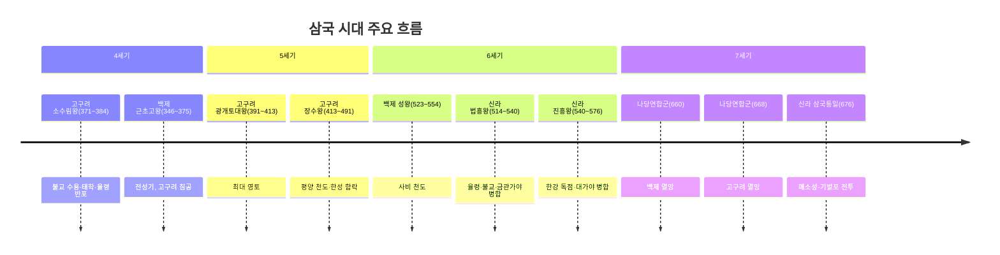

# ⚔️ 삼국 시대 (고구려·백제·신라·가야) — 한국사능력검정 고급 대비

> [!IMPORTANT]
> 이 자료는 한국사능력검정시험 **고급(1·2급)** 대비용으로 작성되었습니다.
> ⭐ 빈출 개념 / 🔴 핵심 개념을 중심으로 학습하세요.

---

## 1. 시대 개관

삼국 시대는 고구려·백제·신라 세 나라가 한반도를 중심으로 패권을 다투던 시기다. 각 나라는 연맹 왕국 단계에서 **율령 반포 → 불교 수용 → 관등제 정비** 를 통해 고대 국가로 발전하였다.



> [!NOTE]
> **고대 국가의 4대 조건**: ① 왕위 부자 세습 ② 율령 반포 ③ 불교 수용 ④ 영토 확장

---

## 2. 고구려 🔴

### 2-1. 건국과 초기 발전

- **건국 **: BC 37년,** 주몽(동명성왕)**, 졸본(환인) 지역
- **천도 **: 졸본 →** 국내성(집안)**→ 평양(427년)

### 2-2. ⭐ 왕별 주요 업적

| 왕 | 재위 | 핵심 업적 |
|----|------|-----------|
|**태조왕**| 53~146 | 계루부 고씨 왕위 독점 세습, 옥저 복속, 요동 진출 |
|**고국천왕 **| 179~197 | 5부 행정 구역화, 부자 상속 확립,** 을파소 등용 **(196),** 진대법 실시(194)**|
|**미천왕 **| 300~331 |** 낙랑군 축출(313)**, 대방군 축출(314) → 한 4군 소멸 완성 |
| **고국원왕 **| 331~371 | 백제** 근초고왕 **에 의해** 평양성에서 전사(371)**|
|**소수림왕 **| 371~384 |** 불교 수용(372)**,** 태학 설립(372)**,** 율령 반포(373)**→ 체제 정비 |
|**광개토대왕 **| 391~413 | 최대 영토 확장,'** 영락(永樂)**'연호, 호태왕비, 신라 구원(400년) |
|**장수왕 **| 413~491 |** 평양 천도(427)**, 남진 정책,** 백제 한성 함락(475)**, 충주 고구려비 |
| **문자명왕 **| 491~519 |** 부여 병합(494)**|
|**영양왕 **| 590~618 |** 살수대첩(612)**— 을지문덕 vs 수나라 양제 |
|**영류왕**| 618~642 | 연개소문에 의해 시해 |
|**보장왕 **| 642~668 |** 연개소문 집권 **,** 안시성 싸움(645)**— 당 태종 격퇴,** 고구려 멸망(668)**|

### 2-3. ⭐ 소수림왕의 체제 정비 (371~384)

> 고국원왕 전사의 위기를 극복하고 고구려를 재건한 왕

| 연도 | 사건 | 의미 |
|------|------|------|
|**372년 **| 전진(前秦)에서** 불교 수용**(순도 스님) | 사상적 통합, 왕권 강화 |
|**372년 **|** 태학(太學) 설립**| 유교 교육, 인재 양성 |
|**373년 **|** 율령(律令) 반포**| 국가 통치 규범 성문화 |

### 2-4. ⭐ 광개토대왕 (391~413)

-**연호**: '영락(永樂)' 사용 → 독자적 천하관 표현
- **호태왕비(광개토대왕릉비)**: 414년 장수왕이 건립, 고구려의 건국 신화·정복 사업 기록
- **정복 사업**: 요동·만주 대부분 + 한강 이북 차지
- **신라 구원(400년)**: 왜의 침입을 받은 신라를 도움 (호태왕비 기록)

### 2-5. ⭐ 장수왕의 남진 정책 (413~491)

| 연도 | 사건 | 의의 |
|------|------|------|
| **427년 **|** 평양 천도**| 남진 정책의 시작, 한반도 장악 의지 |
|**450년대**| 나제동맹 강화(백제·신라 공동 대응) | 고구려 위협에 대한 반응 |
|**475년 **|** 백제 한성(위례성) 함락 **,** 개로왕 전사**| 한강 전역 장악 |
|**충주 고구려비**| 장수왕 시기 건립 추정 | 한반도 중부 지배의 증거 |

### 2-6. 고구려의 수·당 전쟁

| 전투 | 연도 | 내용 |
|------|------|------|
|**살수대첩**| 612년 | 을지문덕 — 수나라 30만 대군 격파, 살수(청천강)에서 수공(水攻) |
|**안시성 싸움**| 645년 | 양만춘 — 당 태종의 대군 70일간 격퇴 |

---

## 3. 백제 🔴

### 3-1. 건국과 수도 변천

-**건국 **: BC 18년,** 온조왕**, 한강 유역 위례성(한성)
- **수도 **: 위례성(한성) →** 웅진(475, 공주)**→** 사비(538, 부여)**### 3-2. ⭐ 왕별 주요 업적

| 왕 | 재위 | 핵심 업적 |
|----|------|-----------|
|**온조왕**| BC 18~AD 28 | 건국, 마한 54개 소국 중 하나 |
|**고이왕 **| 234~286 |** 율령 반포 **,** 16관등제·6좌평 **정비,** 공복(관복) 제정**→ 중앙집권 기틀 |
|**근초고왕 **| 346~375 |** 마한 정복 **, 고구려** 평양성 공격(371, 고국원왕 전사)**,** 칠지도 **제작(일본 헌상),** 부자 상속 확립**, 중국·일본 교류 확대 |
| **침류왕 **| 384~385 |** 불교 수용(384)**— 동진(東晉)에서** 마라난타**스님 |
|**비유왕 **| 427~455 |** 나제동맹 체결(433)**— 신라와 동맹 |
|**개로왕 **| 455~475 | 고구려 장수왕에 의해** 한성 함락, 전사(475)**|
|**문주왕 **| 475~477 |** 웅진(공주) 천도(475)**|
|**무령왕 **| 501~523 |** 22담로에 왕족 파견 **, 중국 남조(양나라)와 교류,** 무령왕릉(공주)**|
|**성왕 **| 523~554 |** 사비(부여) 천도(538)**, 국호'** 남부여 **'로 변경,** 신라와 한강 일시 수복(551)**후 신라 배신으로** 관산성 전투 전사(554)**|
|**의자왕 **| 641~660 |** 황산벌 전투 **(계백 vs 김유신),** 백제 멸망(660)**, 나당연합군에 항복 |

### 3-3. ⭐ 고이왕의 체제 정비 (234~286)

| 제도 | 내용 |
|------|------|
| **16관등제**| 관리 등급을 16등급으로 체계화 |
|**6좌평**| 내신·내두·내법·위사·조정·병관 — 6명의 고위직 |
|**공복 제정**| 관등에 따른 복색 차이화 (자·단·청색) |

### 3-4. 백제의 칠지도 ⭐

-**칠지도(七支刀)**: 근초고왕이 일본 야마토 왕에게 헌상
- **의의**: 백제와 왜(일본)의 교류 증거, 백제의 우월적 지위 표현
- **보관**: 현재 일본 이소노카미 신궁 소장

### 3-5. 무령왕릉 ⭐

| 항목 | 내용 |
|------|------|
| **위치**| 충남 공주 |
|**무덤 양식 **|** 벽돌무덤(전축분)**— 중국 남조(양나라) 영향 |
|**특징 **| 백제 왕릉 중 유일하게** 피장자 확인 가능**(지석 출토) |
|**출토 유물**| 금제 관식, 금동신발, 묘지석(지석), 중국 도자기 등 |
|**의의 **| 백제 문화의** 국제성**증명, 중국 남조와의 교류 |

---

## 4. 신라 🔴

### 4-1. 건국과 초기

-**건국 **: BC 57년,** 박혁거세**, 사로(경주)
- **칭호 변화 **: 거서간 → 차차웅 → 이사금 →** 마립간 **→** 왕**### 4-2. ⭐ 왕별 주요 업적

| 왕 | 재위 | 핵심 업적 |
|----|------|-----------|
|**내물마립간 **| 356~402 |** 김씨 왕위 독점 세습 **,** 마립간 칭호**사용, 광개토대왕 도움으로 왜구 격퇴(400) |
|**눌지마립간 **| 417~458 |** 나제동맹(433)**— 고구려 견제 |
|**지증왕 **| 500~514 |** 국호 '신라' 확정 **,** 왕(王) 칭호 **채택,** 우산국(독도·울릉도) 정복(512, 이사부)**, 우경(소 이용 농경) 보급, 순장 금지 |
| **법흥왕 **| 514~540 |** 율령 반포(520)**,** 불교 공인(527, 이차돈 순교)**,** 금관가야 병합(532)**,** 상대등 설치 **,** 병부 설치 **,**'건원(建元)' 연호** 사용 |
|**진흥왕 **| 540~576 |** 대가야 병합(562)**,** 한강 유역 독점 **,** 화랑도 개편 **,** 순수비 4개 **건립,** 황룡사 창건**|
|**진평왕 **| 579~632 | 원광법사** 세속오계**|
|**선덕여왕 **| 632~647 |** 황룡사 9층 목탑 **건립,** 첨성대**건립, 최초의 여왕 |
|**무열왕(김춘추)**| 654~661 |** 최초 진골 출신 왕 **, 당나라와 동맹(나당연합),** 백제 멸망(660)**|
|**문무왕 **| 661~681 |** 고구려 멸망(668)**,** 매소성 전투(675)·기벌포 전투(676)**→** 삼국통일(676)**완성 |

### 4-3. ⭐ 법흥왕의 체제 정비 (514~540)

> 신라의 고대 국가 완성을 이룬 왕

| 연도 | 사건 | 의미 |
|------|------|------|
|**520년 **|** 율령 반포**| 성문법 체계 완성 |
|**527년 **|** 불교 공인**(이차돈 순교) | 귀족 반발 극복, 왕권 강화 |
|**532년 **|** 금관가야 병합**| 가야 지역 흡수 시작 |
|**연호 **|'** 건원(建元)**'사용 | 독자적 천하관 표현 |

> [!IMPORTANT]
>**이차돈의 순교(527)**: 법흥왕이 불교 공인을 위해 이차돈의 목을 베었을 때, 흰 피(유혈)가 흘렀다는 기록 → 귀족 반발을 누르고 불교를 공인하는 계기

### 4-4. ⭐ 진흥왕의 영토 확장 (540~576)

| 사건 | 연도 | 내용 |
|------|------|------|
| **한강 상류 차지**| 551년 | 나제연합으로 고구려 공격 |
|**한강 하류 배신 점령**| 553년 | 백제 영토 빼앗음 → 나제동맹 파기 |
|**관산성 전투 **| 554년 | 배신에 분노한** 성왕 전사**|
|**대가야 병합**| 562년 | 가야 완전 흡수 |
|**순수비 4개**| — | 북한산·마운령·황초령·창녕비 건립 |

### 4-5. ⭐ 화랑도 (花郎徒)

| 항목 | 내용 |
|------|------|
|**기원**| 원래 여성 집단(원화)에서 남성 집단으로 전환 |
|**진흥왕 개편**| 국가 차원의 청소년 수련 단체로 체계화 |
|**세속오계**| 원광법사 작성 — ①충(忠) ②효(孝) ③신(信) ④용(勇) ⑤인(仁) |
|**역할**| 심신 수련, 전투력 강화, 삼국통일의 인재 배출 |
|**대표 인물**| 김유신, 사다함 등 |

---

## 5. 가야 (伽倻) 🔴

### 5-1. 개관

| 구분 | 내용 |
|------|------|
|**성립**| 변한의 소국들이 연합 |
|**성격**| 연맹 왕국 (중앙집권화 실패) |
|**특징**| 철 생산·수출로 번성 |

### 5-2. ⭐ 금관가야와 대가야

| 구분 | 금관가야 | 대가야 |
|------|----------|--------|
|**위치**| 경남 김해 | 경북 고령 |
|**건국 **|** 김수로왕**(AD 42년) | 이진아시왕 |
|**전성기 **|** 전기(1~3세기)**|** 후기(5~6세기)**|
|**특징**| 철 생산·낙랑·왜 수출, 철이 화폐 역할 | 후기 연맹 맹주 |
|**멸망 **| 신라** 법흥왕에 병합(532)**| 신라** 진흥왕에 병합(562)**|

### 5-3. 가야 연맹의 한계

-**중앙집권화 실패**: 왕권이 강화되지 못하고 연맹 단계 유지
- **지리적 약점**: 백제·신라 사이에 끼여 압박 받음
- **4세기 위기**: 고구려 광개토대왕의 남진(400년)으로 금관가야 쇠퇴

---

## 6. 삼국의 중앙집권화 비교표 ⭐ 빈출

| 항목 | 고구려 | 백제 | 신라 |
|------|--------|------|------|
| **율령 반포**| 소수림왕(373) | 고이왕(3세기) | 법흥왕(520) |
|**불교 수용**| 소수림왕(372, 전진) | 침류왕(384, 동진) | 법흥왕(527, 이차돈) |
|**태학 설립**| 소수림왕(372) | — | — |
|**관등제 정비**| 태조왕~소수림왕 | 고이왕(16관등) | 법흥왕 |
|**왕위 부자 세습**| 고국천왕 | 근초고왕 | 내물마립간 |
|**연호 사용**| 광개토대왕(영락) | — | 법흥왕(건원) |
|**전성기**| 광개토대왕·장수왕 | 근초고왕 | 진흥왕 |

---

## 7. 삼국의 대외 관계

### 7-1. 나제동맹 (433~553)

| 시기 | 사건 |
|------|------|
|**433년**| 백제 비유왕 + 신라 눌지마립간 → 동맹 체결 |
|**551년**| 나제 연합으로 한강 유역 탈환 시도 |
|**553년 **| 신라 진흥왕이 백제 영역(한강 하류) 기습 점령 →** 나제동맹 파기**|
|**554년 **| 백제 성왕이 보복 공격 →** 관산성 전투에서 전사**|

### 7-2. 나당동맹 (648)

| 시기 | 사건 |
|------|------|
|**648년**| 신라 김춘추 — 당나라 태종과 군사 동맹 체결 |
|**660년 **| 나당연합군 —** 백제 멸망**(황산벌 전투, 사비성 함락) |
|**668년 **| 나당연합군 —** 고구려 멸망**|
|**675년 **|** 매소성 전투**— 당나라 20만 대군 격퇴 |
|**676년 **|** 기벌포 전투 **— 당나라 수군 격퇴 →** 삼국통일 완성**|

---

## 8. 삼국 문화 (고분 양식·불교·유교)

### 8-1. ⭐ 고분 양식 비교

| 나라 | 시기 | 고분 양식 | 특징 |
|------|------|-----------|------|
|**고구려**| 초기 | 돌무지무덤 | 장군총, 피라미드형 |
|**고구려 **| 후기 |** 굴식돌방무덤(석실봉토분)**| 벽화 (수렵도·사신도 등) |
|**백제**| 한성기 | 돌무지무덤 | 석촌동 고분 (고구려 영향) |
|**백제 **| 웅진기 |** 벽돌무덤(전축분)**+ 굴식돌방 |** 무령왕릉**(중국 남조 영향) |
|**백제**| 사비기 | 굴식돌방무덤 | 규모 소형화 |
|**신라 **| 통일 전 |** 돌무지덧널무덤(적석목곽분)**| 천마총·황남대총, 도굴 불가 |
|**신라**| 통일 후 | 굴식돌방무덤 | 화장 유행, 12지신상 |

> [!TIP]
>**신라 적석목곽분(돌무지덧널무덤)** 의 특징:
> - 나무 덧널 위에 돌을 쌓고 봉토를 덮음
> - 도굴이 매우 어려워 **금관·토기·말갖춤** 등 다량 출토
> - 천마총에서 **천마도(말다래)** 출토

### 8-2. 고구려 고분 벽화 ⭐

| 벽화 | 시기 | 내용 |
|------|------|------|
|**수렵도**| 초기 | 말 타고 사냥하는 장면 → 기마 문화 |
|**풍속도**| 중기 | 씨름·무용 등 당시 생활상 |
|**사신도**| 후기 | 청룡·백호·주작·현무 → 도교 영향 |

### 8-3. 삼국의 불교 수용

| 나라 | 연도 | 수용 경로 | 목적 |
|------|------|-----------|------|
|**고구려**| 372년 | 전진(前秦) — 순도 스님 | 사상 통합, 왕권 강화 |
|**백제**| 384년 | 동진(東晉) — 마라난타 스님 | 사상 통합, 왕권 강화 |
|**신라**| 527년 | 고구려 → 신라(이차돈 순교) | 귀족 반발 극복, 왕권 강화 |

> [!NOTE]
> 삼국 모두 불교를 **왕권 강화와 사상 통합의 도구** 로 활용하였다.

---

## 9. 한강 유역 쟁탈 흐름 ⭐ 빈출

한강 유역 = 중국과 교류의 창구 + 비옥한 농토 + 한반도 중심부


| 시기 | 한강 주인 | 사건 |
|------|-----------|------|
| **4세기 **|** 백제**| 근초고왕 — 한강 유역 완전 장악, 고구려 평양성 공격(371) |
|**5세기 **|** 고구려**| 장수왕 — 한성 함락(475), 개로왕 전사 |
|**6세기 초 **|** 고구려**| 장수왕 이후 유지 |
|**551년 **|** 백제+신라**| 나제동맹으로 한강 상류 수복 |
|**553년 **|** 신라**| 진흥왕 배신 — 한강 전체 독점 |
|**676년 이후 **|** 신라**| 삼국통일 → 한강 신라 영토 |

> [!IMPORTANT]
> 한강 유역을 차지하는 국가 = 그 시기의 **패권국**> 4세기=백제, 5세기=고구려, 6세기=신라의 전성기와 일치!

---

## 10. ⭐ 빈출 개념

### 왕과 업적 연결 (최빈출)

```
고구려 소수림왕 → 불교(372)·태학(372)·율령(373)
백제 고이왕    → 16관등·6좌평·공복 (3세기)
백제 근초고왕  → 마한정복·고국원왕 전사·칠지도 (4세기)
백제 침류왕    → 불교 수용 384년 (동진 마라난타)
백제 무령왕    → 22담로·무령왕릉 (벽돌무덤)
백제 성왕      → 사비 천도(538)·남부여·관산성 전사(554)
신라 지증왕    → 신라·왕 칭호·우산국(512)·우경
신라 법흥왕    → 율령(520)·불교(527)·금관가야(532)·건원 연호
신라 진흥왕    → 대가야(562)·한강 독점·화랑도·순수비 4개
```

### 고분 양식 암기

```
고구려: 돌무지 → 굴식돌방(벽화)
백제:   돌무지(한성) → 벽돌(웅진·무령왕릉) → 굴식돌방(사비)
신라:   적석목곽(돌무지덧널, 천마총) → 굴식돌방(통일 후)
```

### 헷갈리는 개념 정리

| 개념 | 내용 |
|------|------|
|**나제동맹**| 433년 성립, 553년 진흥왕이 파기 |
|**살수대첩**| 612년, 을지문덕 vs 수 양제 |
|**안시성**| 645년, 당 태종 격퇴 (성주 이름은 양만춘 — 정사 미상) |
|**황산벌 전투**| 660년, 계백(백제) vs 김유신(신라) |
|**매소성·기벌포**| 675·676년, 당군 격퇴 → 삼국통일 완성 |

---

## 11. 🔴 핵심 개념 요약

1.**고구려 소수림왕**: 불교·태학·율령 → 3종 세트 암기
2. **백제 근초고왕**: 마한 정복, 고국원왕 전사(371), 칠지도 → 4세기 백제 전성기
3. **백제 성왕**: 사비 천도(538), 남부여, 관산성 전사(554)
4. **신라 법흥왕**: 율령(520), 불교(527, 이차돈), 금관가야(532), 건원 연호
5. **신라 진흥왕**: 한강 독점(553), 대가야(562), 화랑도, 순수비 4개
6. **한강 유역**: 4세기 백제 → 5세기 고구려 → 6세기 신라
7. **고분**: 신라 적석목곽분(도굴 불가), 백제 무령왕릉(벽돌, 피장자 확인)
8. **삼국통일**: 660 백제 멸망 → 668 고구려 멸망 → 676 나당전쟁 승리

---

## 12. 연표

| 연도 | 사건 |
|------|------|
| **BC 57년**| 박혁거세 — 신라(사로) 건국 |
|**BC 37년**| 주몽 — 고구려 건국 |
|**BC 18년**| 온조 — 백제 건국 |
|**AD 42년**| 김수로왕 — 금관가야 건국 |
|**194년**| 고구려 고국천왕 — 진대법 실시 |
|**234년**| 백제 고이왕 — 16관등·6좌평 정비 |
|**313년**| 고구려 미천왕 — 낙랑군 축출 |
|**346년**| 백제 근초고왕 즉위 |
|**371년**| 백제 근초고왕 — 고구려 평양성 공격, 고국원왕 전사 |
|**372년**| 고구려 소수림왕 — 불교 수용, 태학 설립 |
|**373년**| 고구려 소수림왕 — 율령 반포 |
|**384년**| 백제 침류왕 — 불교 수용 |
|**391년**| 고구려 광개토대왕 즉위 |
|**400년**| 광개토대왕 — 신라 구원, 왜구 격퇴 |
|**413년**| 고구려 장수왕 즉위 |
|**427년**| 고구려 장수왕 — 평양 천도 |
|**433년**| 백제·신라 — 나제동맹 체결 |
|**475년**| 고구려 장수왕 — 백제 한성 함락, 개로왕 전사 / 백제 웅진 천도 |
|**494년**| 고구려 — 부여 병합 |
|**500년**| 신라 지증왕 즉위 |
|**512년**| 신라 — 이사부 우산국(울릉도) 복속 |
|**514년**| 신라 법흥왕 즉위 |
|**520년**| 신라 법흥왕 — 율령 반포 |
|**527년**| 신라 — 이차돈 순교, 불교 공인 |
|**532년**| 신라 — 금관가야 병합 |
|**538년**| 백제 성왕 — 사비(부여) 천도, 국호 남부여 |
|**540년**| 신라 진흥왕 즉위 |
|**551년**| 나제동맹 — 한강 유역 공동 공략 |
|**553년**| 신라 진흥왕 — 한강 하류 독점, 나제동맹 파기 |
|**554년**| 관산성 전투 — 백제 성왕 전사 |
|**562년**| 신라 진흥왕 — 대가야 병합 |
|**612년**| 살수대첩 — 을지문덕 vs 수 양제 |
|**632년**| 신라 선덕여왕 즉위 (최초 여왕) |
|**645년**| 안시성 싸움 — 당 태종 격퇴 |
|**648년**| 신라 김춘추 — 나당동맹 체결 |
|**654년**| 신라 무열왕(김춘추) 즉위 — 최초 진골 왕 |
|**660년 **| 황산벌 전투 →** 백제 멸망**|
|**661년**| 신라 문무왕 즉위 |
|**668년 **|** 고구려 멸망**|
|**675년**| 매소성 전투 — 당군 육군 격퇴 |
|**676년 **| 기벌포 전투 — 당군 수군 격퇴 →** 삼국통일 완성** |

---

## 13. 참고 출처 URL

| 출처 | URL |
|------|-----|
| 한국민족문화대백과 — 고구려 | https://encykorea.aks.ac.kr/Article/E0002505 |
| 한국민족문화대백과 — 백제 | https://encykorea.aks.ac.kr/Article/E0022205 |
| 한국민족문화대백과 — 신라 | https://encykorea.aks.ac.kr/Article/E0033232 |
| 한국민족문화대백과 — 가야 | https://encykorea.aks.ac.kr/Article/E0001015 |
| 국사편찬위원회 한국사데이터베이스 | https://db.history.go.kr |
| 국가유산청 — 무령왕릉 | https://www.heritage.go.kr |
| 국립중앙박물관 | https://www.museum.go.kr |
| 한국사능력검정시험 공식 사이트 | https://www.historyexam.go.kr |
| 백제문화재연구원 | https://www.baekje-heritage.or.kr |

---

*작성 기준: 한국사능력검정시험 고급(1·2급) 출제 범위 및 수준*
*최종 업데이트: 2026년 5월*
